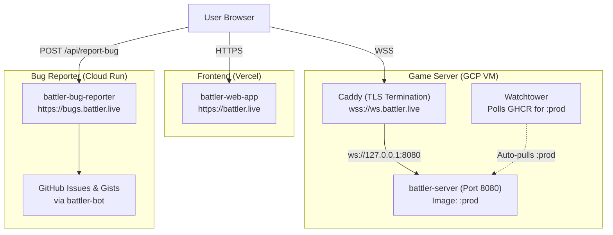

# Battler Deployment & Operations Guide

This guide details the production architecture, automated CI/CD pipelines, release procedures, and operational runbooks for Battler across its three tiers: **Frontend** (`battler.live`), **Game Server** (`ws.battler.live`), and **Bug Reporter** (`bugs.battler.live`).

---

## 1. Architecture Overview

Battler runs on a decoupled three-tier architecture:



### Production Endpoints

| Service | Production Endpoint | Protocol | Purpose |
| :--- | :--- | :--- | :--- |
| **Frontend** | `https://battler.live` *(or `https://www.battler.live`)* | HTTPS | Web application & battle simulator UI |
| **Game Server** | `wss://ws.battler.live` | WSS | Realtime WAMP game server & battle engine |
| **Bug Reporter** | `https://bugs.battler.live/api/report-bug` | HTTPS (POST) | Client diagnostic relay to GitHub issues & gists |
| **Reporter Health**| `https://bugs.battler.live/health` | HTTPS (GET) | Service health check & target repository status |

---

## 2. Software Architecture & Services

### Game Server Stack
* **Containers** (orchestrated via [`docker-compose.prod.yml`](docker-compose.prod.yml)):
  * `battler-server`: Rust WAMP game engine running on host port `8080`, tracking the **`:prod`** container image tag.
  * `caddy`: Reverse proxy providing automated TLS termination on ports 80/443, forwarding traffic to `127.0.0.1:8080`.
  * `watchtower`: Automated update daemon polling GHCR every 120s for new digests of **`:prod`** and restarting `battler-server`.
* **Host Provisioning**: [`setup-vm.sh`](setup-vm.sh) installs dependencies and launches the Compose stack.

### Bug Reporter Service (`battler-bug-reporter`)
* **Application**: ASP.NET Core (.NET 10) Minimal API deployed to Google Cloud Run.
* **GitHub Integration**: Uses the `battler-bot` machine account with a Classic PAT (`repo` + `gist` scopes) to create issues and secret diagnostic Gists.
* **Health Check**: `GET https://bugs.battler.live/health` reports runtime status and target repository.

### Frontend Web Client (`battler-web-app`)
* **Application**: React 19, Vite, TypeScript, and compiled Rust WebAssembly (`battler-state-wasm`) deployed to Vercel.
* **Build-Time Config**: Targets `ws.battler.live` for WebSocket connections and `https://bugs.battler.live/api/report-bug` for diagnostic submissions.

---

## 3. GitHub Actions Workflows

### Workflow Catalog

| Workflow | File | Triggers | Description |
| :--- | :--- | :--- | :--- |
| **Deploy battler.live** | [`.github/workflows/deploy-battler-live.yml`](../.github/workflows/deploy-battler-live.yml) | `workflow_dispatch` (Input: `release_tag`) | **Single-Button Production Rollout**: Promotes server image to `:prod`, deploys Cloud Run, deploys Vercel, and runs smoke checks. |
| **Deploy battler-web-app** | [`.github/workflows/deploy-web-app.yml`](../.github/workflows/deploy-web-app.yml) | `push: tags: ["battler-web-app-v*"]`, `workflow_dispatch` | Builds WASM engine and deploys web app UI directly to Vercel (instant, zero server downtime). |
| **Publish battler-server** | [`.github/workflows/docker-publish-server.yml`](../.github/workflows/docker-publish-server.yml) | `push: tags: ["battler-live-v*", "battler-server-v*"]`, `workflow_dispatch` | Compiles server image and pushes to GHCR. Has an optional `promote_to_prod` toggle. |
| **Publish battler-bug-reporter** | [`.github/workflows/docker-publish-bug-reporter.yml`](../.github/workflows/docker-publish-bug-reporter.yml) | `push: tags: ["battler-live-v*", "battler-bug-reporter-v*"]`, `workflow_dispatch` | Compiles bug reporter image and pushes to GHCR. Has an optional `deploy` toggle. |

### Required Repository Secrets
Configure under **Settings** $\rightarrow$ **Secrets and variables** $\rightarrow$ **Actions**:

* **`GCP_SA_KEY`**: JSON credentials for Service Account `github-actions-deployer` (granted `roles/run.developer` on the Cloud Run service and `roles/iam.serviceAccountUser` on the runtime SA).
* **`VERCEL_TOKEN`**: Vercel deployment token.
* **`VERCEL_ORG_ID`**: Vercel organization ID.
* **`VERCEL_PROJECT_ID`**: Vercel project ID for `battler-web-app`.

---

## 4. Release Process

Battler uses an unambiguous, component-namespaced tagging model to prevent collisions across the monorepo's crates and packages:

```
[ Phase 1: Tag & Build Ahead of Time ]
  git tag battler-live-v0.2.0 && git push origin battler-live-v0.2.0
      │
      ▼
  Builds & pushes containers to GHCR (:battler-live-v0.2.0)
  (Production is completely untouched. Games continue.)

[ Phase 2: Production Maintenance Window ]
  GitHub Actions ➔ "Deploy battler.live" ➔ Run "battler-live-v0.2.0"
      │
      ├─► Deploys Web App to Vercel (~45s)
      ├─► Deploys Bug Reporter to Cloud Run (~15s)
      └─► Promotes Server image to :prod (< 2s)
            │
            ▼
          Watchtower detects :prod on VM & restarts server (< 5s downtime)
```

### Step-by-Step New Release Checklist

1. **Pre-flight Tests**:
   ```bash
   cargo test --workspace
   cd js-clients/battler-web-app && npm test && npx oxlint && cd ../..
   cd battler-bug-reporter && dotnet test && cd ..
   ```

2. **Cut Release Tag (Pre-Build)**:
   ```bash
   git checkout main && git pull origin main
   git tag battler-live-v0.2.0 -m "Release battler.live v0.2.0"
   git push origin battler-live-v0.2.0
   ```
   *Compiles all Docker containers and pushes `:battler-live-v0.2.0` to GHCR. Production remains active.*

3. **Deploy to Production (Maintenance Window)**:
   * In GitHub Actions, select **"Deploy battler.live"**.
   * Click **Run workflow**, enter `battler-live-v0.2.0`, and run.

4. **Verify Smoke Endpoints**:
   ```bash
   curl -sI https://battler.live | head -n 1
   curl -sI https://ws.battler.live | head -n 1
   curl -s https://bugs.battler.live/health
   ```

### Component-Specific Deployments
You do not need to trigger a full platform release for individual component updates:
* **Frontend only**: Push tag `battler-web-app-v*` (or run **"Deploy battler-web-app"**).
* **Game Server only**: Push tag `battler-server-v*` (or run **"Publish battler-server"** with `promote_to_prod = true`).
* **Bug Reporter only**: Push tag `battler-bug-reporter-v*` (or run **"Publish battler-bug-reporter"** with `deploy = true`).

---

## 5. Operations & Rollbacks

### Server VM Commands
```bash
# Check running containers
sudo docker compose -f /opt/battler/docker-compose.yml ps

# View live battle server logs
sudo docker compose -f /opt/battler/docker-compose.yml logs -f battler-server

# View Caddy TLS / proxy logs
sudo docker compose -f /opt/battler/docker-compose.yml logs -f caddy

# Immediate server restart without waiting for Watchtower
cd /opt/battler && sudo docker compose pull && sudo docker compose up -d
```

### Full VM Re-Provisioning
To bootstrap or restore a new VM:
```bash
curl -sSL https://raw.githubusercontent.com/jackson-nestelroad/battler/main/deploy/setup-vm.sh | bash
```

### Rollback Procedures
* **Full Platform Rollback**: In GitHub Actions $\rightarrow$ run **"Deploy battler.live"** with the previous release tag (e.g. `battler-live-v0.1.9`). This instantly retags the previous server image to `:prod`, rolls Cloud Run back to that release, and redeploys the matching web app to Vercel.
* **Frontend only**: Go to **Vercel Dashboard** $\rightarrow$ `battler-web-app` $\rightarrow$ **Deployments** $\rightarrow$ select previous deployment $\rightarrow$ **Instant Rollback**.
* **Bug Reporter only**: Go to **GCP Console** $\rightarrow$ **Cloud Run** $\rightarrow$ `battler-bug-reporter` $\rightarrow$ **Revisions** $\rightarrow$ route 100% of traffic to previous revision.
* **Game Server only (Zero-SSH)**: In GitHub Actions $\rightarrow$ run **"Publish battler-server"** on the previous working tag (e.g. `battler-server-v0.1.9` or `battler-live-v0.1.9`) with `promote_to_prod = true`. Watchtower rolls back the VM automatically.
