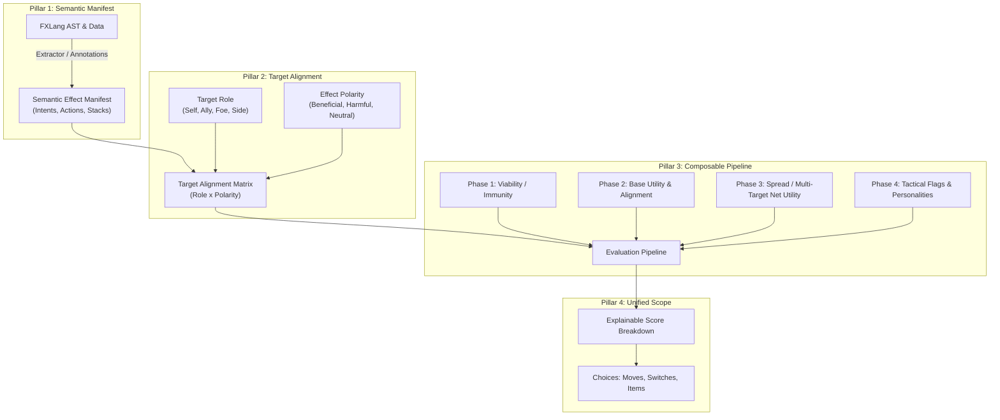
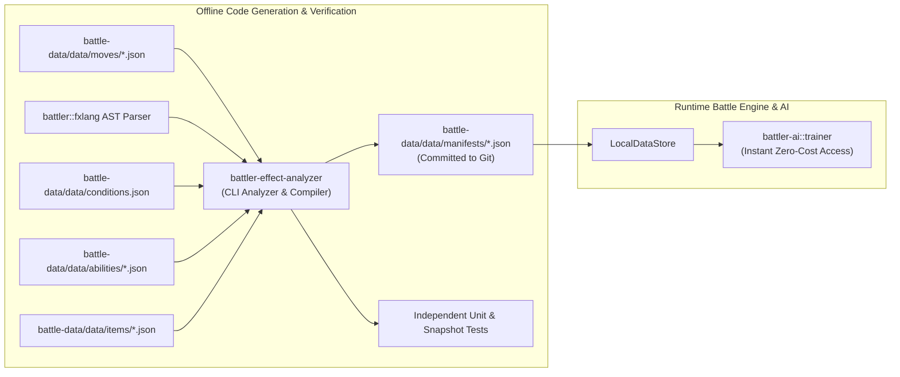
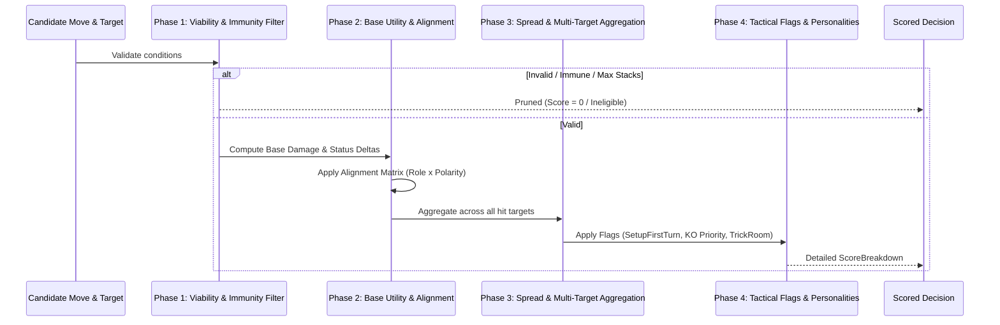
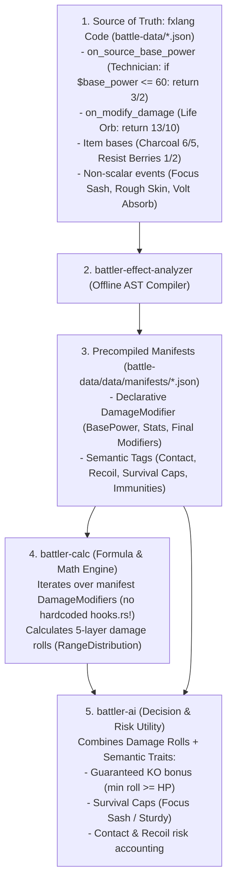
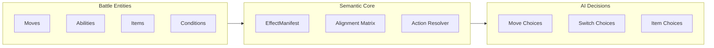
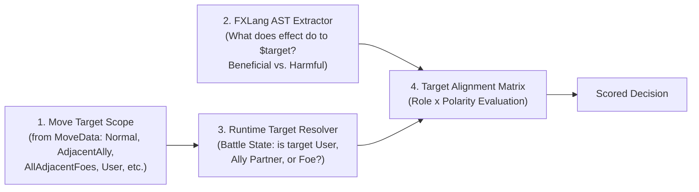

# Design Specification: Next-Generation `battler-ai` Trainer Engine

## Executive Summary

The current `battler-ai::trainer` module serves as a foundation for rule-based battle decision-making. However, as the battle system has evolved to support complex interactions in **`fxlang`** (the interpreted scripting language for battle effects), several structural limitations in `battler-ai` have become apparent:

1. **Disconnected from FXLang**: Game mechanics and battle effects are implemented in `fxlang` and data definitions, but `battler-ai` has zero visibility into what `fxlang` code actually does. Instead, it relies on a hardcoded, coarse `StatusEffect` struct in `battler-calc` and hardcoded string matches (`"Stockpile"`, `"Spikes"`, `"Trick Room"`).
2. **Lack of Effect Polarity & Target Alignment**: The engine does not have a formal understanding of **Beneficial** vs. **Harmful** effects or **Allies** vs. **Foes**. A hardcoded `-30` penalty is applied to *any* move targeting an ally—penalizing helpful moves like *Heal Pulse*, *Helping Hand*, or *Coaching*—while stat drops and healing lack awareness of whether the recipient is a friend or foe.
3. **Broken Hook Execution Model**: The scoring loop breaks on the first hook that changes the score (`if *score != old_score { break; }`), preventing rules from composing, stacking, or providing nuanced evaluation.
4. **Flawed Multi-Target Averaging**: Scores for spread moves (e.g., *Earthquake*, *Surf*, *Heat Wave*) are simply averaged across all affected targets (`sum / count`), which severely miscalculates risk (e.g., hitting two opponents for high damage while fainting an ally partner).
5. **Limited Extensibility**: Extending AI evaluation to abilities, held items, battle conditions, and trainer items currently requires writing isolated, repetitive Rust rules rather than leveraging a unified semantic framework.

This document proposes a comprehensive architectural redesign for `battler-ai` that starts with clean, intuitive fundamentals and scales systematically to the entire battle ecosystem.

Companion implementation plan:
👉 **[trainer-ai-rehaul-implementation-plan.md](trainer-ai-rehaul-implementation-plan.md)**

---

## The Core Problems in Detail

### 1. The Disconnection between FXLang & AI Rules

In `battler`, an effect (move, ability, item, condition) executes arbitrary logic via `fxlang` event callbacks:

```json
// Example: Pain Split (move)
{
  "effect": {
    "callbacks": {
      "on_hit": [
        "$target_hp = $target.undynamaxed_hp",
        "$average_hp = func_call(max: 1 expr(($target_hp + $source.hp) / 2))",
        "set_hp: $target $average_hp",
        "set_hp: $source $average_hp"
      ]
    }
  }
}
```

Because `battler-ai` cannot introspect or execute `fxlang`, it must guess what moves do. Currently, `battler-calc` simulates moves into a flat `MultiHit` with a rudimentary `StatusEffect`:

```rust
// battler-calc StatusEffect
pub struct StatusEffect {
    pub volatile: Option<String>,
    pub side_condition: Option<String>,
    pub weather: Option<String>,
    pub terrain: Option<String>,
    pub pseudo_weather: Option<String>,
    pub boosts: Option<BoostTable>,
    pub status: Option<String>,
    pub switch: bool,
    pub heal: Fraction<u64>,
    pub damage: Fraction<u64>,
}
```

Any move whose behavior lives in an `fxlang` callback (e.g., *Leech Seed*, *Taunt*, *Encore*, *Pain Split*, *Substitute*, *Trick*, *Tailwind*, *Stealth Rock*, *Aurora Veil*) is either completely opaque or must be manually re-implemented with custom Rust hooks in `battler-calc` AND custom scoring rules in `battler-ai`.

### 2. Lack of Target Polarity & Alignment

In `battler-ai/src/trainer/hooks.rs`, line 58 explicitly notes:
```rust
// TODO: Need to better represent allies vs. targets, beneficial vs. harmful effects.
```

Currently:
- Line 64: `if target.mon.is_ally(&context.mon)? { *score -= 30; }` blindly penalizes hitting an ally, making beneficial ally-targeting moves unusable by the AI.
- Line 196: `Move heals the target at full health -> *score -= 8` does not check if the target is a foe. Healing an opponent at 50% HP receives *no* penalty under this rule, even though healing an opponent is almost universally disastrous!
- Line 220: `Move boosts stats that are already maxed out` does not check if the target is a foe. If a move boosts an opponent's stats, the AI does not recognize it as bad unless the stat is already +6!

### 3. Early-Exit Scoring Pipeline

In `battler-ai/src/trainer/trainer.rs`:

```rust
async fn modify_move_score_with_hooks(
    &self,
    context: &TrainerMonContext<'_>,
    move_name: &str,
    target: &Target<'_>,
    score: &mut i64,
    hooks: &[hooks::ModifyMoveScore],
) -> Result<()> {
    let old_score = *score;
    for hook in hooks {
        hook(context, move_name, target, score).await?;
        if *score != old_score {
            break; // <-- Halts all subsequent evaluation!
        }
    }
    Ok(())
}
```

Once any hook fires (e.g., the move hits an ally), the loop terminates immediately. Failure checks, stat caps, speed checks, and damage calculations are completely skipped.

---

## Architectural Pillars of the New Design

The new architecture is organized around four core pillars:



---

## Pillar 1: Bridging FXLang & Effect Semantics

How should `battler-ai` know what an effect does without duplicating the entire battle engine? We examine three design options:

### Option Comparison

| Feature / Metric | Option A: Pure Data Declarations | Option B: FXLang AST Introspection | Option C: Hybrid Semantic Manifest (Recommended) |
| :--- | :--- | :--- | :--- |
| **Approach** | Annotate every move/item/ability JSON with explicit `ai_intent` tags. | Run a static AST analyzer over `fxlang` code to infer actions. | Extract semantics from FXLang AST automatically; allow optional JSON intent overrides. |
| **Maintenance** | High: Every new move or change requires manual metadata updates. | Low: Automatic extraction from existing effect code. | **Lowest**: Zero boilerplate for standard effects; explicit control for complex edge cases. |
| **Connection to FXLang** | Disconnected (metadata could drift from code). | Directly derived from FXLang AST. | **Directly connected & verifiable**. |
| **Handling Edge Cases** | Excellent (human specifies intent). | Moderate (complex conditionals/loops can obscure intent). | **Excellent** (fallback to human hints when AST analysis is ambiguous). |

---

### Recommended Solution: The Hybrid Semantic Manifest

We define an **`EffectManifest`** that represents what an effect intends to accomplish.

```rust
/// The semantic intent of an effect action.
#[derive(Debug, Clone, PartialEq, Eq, Serialize, Deserialize)]
pub enum EffectPolarity {
    /// Beneficial to the recipient (e.g., Heal, Stat Buff, Screen, Tailwind).
    Beneficial,
    /// Harmful to the recipient (e.g., Damage, Stat Debuff, Status, Hazard, Taunt).
    Harmful,
    /// Contextual / Neutral (e.g., Trick Room, Weather, Haze, Transform).
    Neutral,
}

/// A specific action produced by an effect.
#[derive(Debug, Clone, PartialEq, Serialize, Deserialize)]
pub enum SemanticAction {
    Damage {
        category: MoveCategory,
        base_power: Option<u64>,
        recoil_percent: Option<Fraction<u64>>,
        drain_percent: Option<Fraction<u64>>,
    },
    StatChange {
        boosts: BoostTable,
    },
    StatusInfliction {
        status: String,
        chance: Fraction<u64>,
    },
    StatusCure {
        statuses: Vec<String>, // Empty means all non-volatile statuses
    },
    ApplyCondition {
        condition_id: String,
        is_volatile: bool,
        max_stacks: u32,
    },
    ApplySideCondition {
        condition_id: String,
        max_stacks: u32,
    },
    SetFieldCondition {
        condition_id: String,
    },
    Heal {
        fraction: Fraction<u64>,
    },
    ForceSwitch {
        target: bool, // true = force target out, false = self-switch (U-turn)
    },
    Protection,
}

/// Manifest summarizing an effect's behavior and polarity.
#[derive(Debug, Clone, Serialize, Deserialize)]
pub struct EffectManifest {
    pub id: String,
    pub target_scope: MoveTarget,
    pub default_polarity: EffectPolarity,
    pub actions: Vec<(EffectPolarity, SemanticAction)>,
    pub requirements: Vec<EffectRequirement>,
}

#[derive(Debug, Clone, Serialize, Deserialize)]
pub enum EffectRequirement {
    TargetNotStatused,
    TargetNotCondition(String),
    SideConditionUnderMaxStacks(String, u32),
    WeatherNotActive(String),
    TerrainNotActive(String),
    StatNotCapped(Boost, i8),
    HealthBelowFull,
}
```

#### Execution Model: Offline Static Generation vs. Runtime Extraction

Rather than running the FXLang AST visitor dynamically at runtime (which would impose startup latency and force `battler-ai` to depend on the `fxlang` interpreter and parser crates), **we generate manifests statically ahead of time via a dedicated CLI tool**.



#### Why Static Generation is Superior

1. **Zero Runtime Overhead & Instant Startup**:
   - `battler-ai` does not parse ASTs on startup. It simply queries precomputed, typed manifests (`LocalDataStore::get_move_manifest(&id)`).
2. **Clean Crate Decoupling**:
   - `battler-ai` does not need to link against `battler`'s `fxlang` parser, lexer, or token stream types. It only requires the lightweight `EffectManifest` types defined in `battler-effect-analyzer-schema`.
3. **Independent Testability**:
   - The generator can be tested in complete isolation:
     - **Unit Tests**: Verifying specific extraction rules (e.g. `heal` statement extracts to `SemanticAction::Heal` with `Beneficial` polarity).
     - **Snapshot Tests**: Golden-file tests comparing all 936 moves. Any unintentional drift in move classification is caught instantly by `cargo test`.
4. **Transparent Git Diffs & PR Reviews**:
   - Because `battle-data/data/manifests/*.json` is committed to version control, any move change or new generation immediately shows its semantic impact in Git diffs.
5. **CI Drift Detection**:
   - Running `cargo run -p battler-effect-analyzer -- --check` in CI fails the build if move JSONs were modified without regenerating manifests.

---

## Pillar 2: Target Alignment & Polarity Matrix

To solve the "allies vs foes, beneficial vs harmful" problem universally, we separate the **Recipient's Role** from the **Effect's Polarity**.

### 1. Target Roles

```rust
#[derive(Debug, Clone, Copy, PartialEq, Eq, Hash, Serialize, Deserialize)]
pub enum TargetRole {
    User,
    Ally,
    Foe,
    AllySide,
    FoeSide,
    Field,
}

impl TargetRole {
    pub fn from_mon_relationship(user: &Mon, target: &Mon) -> Result<Self> {
        if user.is_same(target)? {
            Ok(Self::User)
        } else if user.is_ally(target)? {
            Ok(Self::Ally)
        } else {
            Ok(Self::Foe)
        }
    }
}
```

### 2. The Alignment Matrix

The AI evaluates desirability by cross-referencing `TargetRole` with `EffectPolarity`:

| Target Role | Beneficial Effect | Harmful Effect | Neutral / Contextual |
| :--- | :--- | :--- | :--- |
| **User** | **Strongly Desirable (+)**<br>Scale by need (HP deficit, unboosted stats). | **Penalized (-)**<br>Recoil, self-debuff, self-KO. | Evaluated based on game state. |
| **Ally** | **Strongly Desirable (+)**<br>Heal damaged partner, Helping Hand, Coaching. | **Severely Penalized (-)**<br>Hitting ally, inflicting status, stat drops. | Neutral (weather, room effects). |
| **Foe** | **Severely Penalized (-)**<br>Healing opponent, boosting opponent stats. | **Strongly Desirable (+)**<br>Damage, status infliction, stat debuffs. | Evaluated based on opponent team. |
| **Ally Side** | **Desirable (+)**<br>Reflect, Light Screen, Tailwind, Safeguard. | **Prohibited (-)**<br>Placing hazards on own side. | Contextual. |
| **Foe Side** | **Prohibited (-)**<br>Placing screens on foe side. | **Desirable (+)**<br>Stealth Rock, Spikes, Sticky Web. | Contextual. |

### 3. Net Utility for Spread Moves (Fixing the Multi-Target Average)

In doubles, moves like *Earthquake* or *Surf* affect all adjacent Mons.
Instead of averaging the scores across targets (`(Foe1 + Foe2 + Ally) / 3`), the engine computes **Net Spread Utility**:

$$\text{NetUtility} = \sum_{t \in \text{Foes}} \text{Utility}(t) - \sum_{a \in \text{Allies}} \text{HarmPenalty}(a) + \sum_{a \in \text{Allies}} \text{BenefitUtility}(a)$$

#### Example: Earthquake in Doubles
- Foe 1 takes 60% HP $\rightarrow +60$ utility
- Foe 2 takes 50% HP $\rightarrow +50$ utility
- **Case A (Ally is Flying or has Telepathy)**: Ally is immune $\rightarrow 0$ penalty.  
  $\text{NetUtility} = 60 + 50 - 0 = \mathbf{+110}$ (Strong move!).
- **Case B (Ally takes 75% HP damage)**: Ally harm penalty $\rightarrow -120$.  
  $\text{NetUtility} = 60 + 50 - 120 = \mathbf{-10}$ (AI rejects or chooses single-target move!).

---

## Pillar 3: Composable Evaluation Pipeline

Instead of a single mutable loop with early breaks, evaluation proceeds through a 4-phase pipeline:



### Pipeline Phases

#### Phase 1: Viability & Immunity Filter
Quick-exit pruning rules that set the score to 0 if the move is guaranteed to fail or be useless:
- Type immunity without bypass (e.g., Electric on Ground).
- Target already has non-volatile status (e.g., Thunder Wave on burned target).
- Volatile condition already active (e.g., Taunt on already taunted target).
- Side condition at max stacks (e.g., Spikes when 3 layers already present).
- Weather/Terrain already active.
- Stat modification impossible (e.g., Screech on $-6$ Defense target, Swords Dance at $+6$ Attack).
- Healing move when user/ally is at $100\%$ HP.
- Status move while taunted.

#### Phase 2: Base Utility & Alignment
Computes the baseline value of the action:
- **Damage Utility & KO Thresholds**: Evaluates the simulated damage distribution from `battler-calc`.
- **Status / Debuff Utility**: Evaluated only when used on **Foe** (positive) or **Ally** (negative).
- **Buff / Heal Utility**: Evaluated only when used on **Ally/User** (positive) or **Foe** (negative).



#### Complete Elimination of Both `hooks.rs` Files

A central achievement of this unified architecture is the **100% deletion of both legacy hook files** in the codebase:
1. **`battler-calc/src/hooks.rs` (1,457 lines $\rightarrow$ DELETED)**: All static macros (`type_powering_ability!`, `gem!`, `MODIFY_BASE_POWER_HOOKS`, `MODIFY_DAMAGE_HOOKS`, `FAIL_MOVE_BEFORE_HIT_HOOKS`) are eliminated. `battler-calc` becomes a pure math and formula engine iterating over declarative manifest fields (`DamageModifier`, `FixedDamage`, `ImmunityRule`, `EffectFlag`).
2. **`battler-ai/src/trainer/hooks.rs` (300 lines $\rightarrow$ DELETED)**: All ad-hoc scoring closures (`BASIC_MODIFY_MOVE_SCORE_HOOKS`) and string checks are eliminated. `battler-ai` becomes a pure decision engine evaluating target alignment and risk utilities.

| Architecture Pillar | Role | Logic Source | Hooks? |
| :--- | :--- | :--- | :---: |
| **`battle-data` (`fxlang`)** | **Source of Truth** | JSON callbacks (`on_source_base_power`, `on_modify_damage`, etc.) | None (Pure JSON) |
| **`battler-effect-analyzer`** | **Offline Compiler** | Statically analyzes `fxlang` AST into manifests | None (CLI tool) |
| **`battler-calc`** | **Pure Calculation Engine** | Evaluates math formulas from manifests (`LocalDataStore`) | **0% Hooks (`hooks.rs` deleted)** |
| **`battler-ai`** | **Pure Scoring Engine** | Evaluates target alignment, tactical priorities, and risk | **0% Hooks (`hooks.rs` deleted)** |

#### The 5 Damage Modifier Layers & Source of Truth

Under the overhauled architecture, **`fxlang` is the sole source of truth**. `battler-effect-analyzer` compiles both scalar damage modifiers and non-scalar semantic tags into manifests, allowing `battler-calc` to become purely data-driven:

| Modifier Layer | Source in `fxlang` | Extracted By `battler-effect-analyzer` | Evaluated By | How AI Consumes It |
| :--- | :--- | :--- | :---: | :--- |
| **1. Base Power** | `on_source_base_power`<br>(*Technician*, *Charcoal*, Terrains) | `DamageModifier::BasePower { factor, condition }` | `battler-calc` | Reflected automatically in damage rolls. |
| **2. Stats** | `on_modify_stat`<br>(*Choice Band/Specs*, *Huge Power*, Burn) | `DamageModifier::Stat { stat, factor, condition }` | `battler-calc` | Reflected automatically in damage rolls. |
| **3. Pre-Random** | Spread hits, Weather damage, Critical hits | Engine rules & weather callbacks | `battler-calc` | Reflected automatically in damage rolls. |
| **4. Random & Types** | 16 Rolls ($85\%-100\%$), STAB, Type chart | Type effectiveness table & STAB | `battler-calc` | AI inspects `min` roll (guaranteed KO) and `avg` roll. |
| **5. Final Modifiers** | `on_modify_damage`, `on_source_modify_damage`<br>(*Life Orb*, *Multiscale*, Resist Berries) | `DamageModifier::Damage { factor, condition }` | `battler-calc` | Reflected automatically in damage rolls. |
| **Non-Scalar Semantics** | `on_damage` (*Focus Sash* cap, *Rocky Helmet* recoil), `on_try_hit` (Immunities) | `AbilityManifest`, `ItemManifest` tags | `battler-ai` | AI risk rules (survival caps, contact penalties). |

#### How `battler-ai` Uses These Modifiers
1. **Guaranteed KO ($100\%$) Bonus**: If the lowest roll (`min_damage >= target_hp`), the move gets a $+50$ priority bonus.
2. **Survival Cap (Focus Sash & Sturdy)**: If defender has *Focus Sash* or *Sturdy* at $100\%$ HP, single-hit moves cannot exceed `target_hp - 1`, stripping their guaranteed KO bonus. Multi-hit moves (*Scale Shot*, *Bullet Seed*) are prioritized instead.
3. **Contact & Recoil Risk Accounting**: If the defender has *Rocky Helmet* or *Rough Skin*, contact moves incur a severe penalty if the recoil would place the user in KO range. Non-contact alternatives (*Flamethrower*, *Aura Sphere*) are favored.

#### Phase 3: Multi-Target & Spread Aggregation
Combines single-target results for spread moves using the Net Spread Utility formula.

#### Phase 4: Tactical Heuristics & Trainer Flags
Modifiers controlled by `TrainerFlag` and trainer personality:
- `TrainerFlag::SetUpFirstTurn`: Bonus for hazards/screens on turn 1.
- `TrainerFlag::EvaluateAttackDamage`: Prioritizes confirmed KOs over incremental status.
- `TrainerFlag::BenefitPartner`: Extra weight on ally-boosting and screen protection in double battles.
- `TrainerFlag::ConsiderHealth`: Low HP shifts priority toward healing or high-priority burst attacks before fainting.
- `TrainerFlag::SetUpWeather`: Prioritizes activating weather if the team composition benefits.

### Explainable Scoring: `ScoreBreakdown`

Every decision produces an inspectable breakdown:

```rust
#[derive(Debug, Clone)]
pub struct ScoreBreakdown {
    pub move_name: String,
    pub target_description: String,
    pub viability_passed: bool,
    pub base_damage_score: i64,
    pub status_utility_score: i64,
    pub alignment_penalty: i64,
    pub tactical_bonuses: Vec<(String, i64)>,
    pub total_score: i64,
}
```

This transforms AI debugging from inspecting mystery integers into clear logs:
```text
Move: Thunder Wave | Target: Foe 1
  Viability: PASSED (Target not statused, Electric affects Water)
  Base Utility: +35 (Inflicts PAR on foe)
  Tactical Bonus (HarassTheOpponent): +15
  Total Score: 150

Move: Sludge Bomb | Target: Ally 2
  Viability: PASSED
  Base Damage: +45
  Alignment Penalty (Harmful on Ally): -100
  Total Score: 45 (Rejected)
```

---

## Pillar 4: Unified Scope: Abilities, Items, and Conditions

The same semantic framework extends naturally to all battle entities:



### 1. Abilities & Held Items
Abilities and items modify the **Viability** and **Utility** phases via manifests:
- **Immunities / Absorptions**: *Water Absorb*, *Flash Fire*, *Levitate*, *Good as Gold* register as immunity modifiers in Phase 1.
- **On-Hit Punishments**: *Rough Skin*, *Iron Barbs*, *Rocky Helmet*, *Flame Body* apply recoil or status risk penalties during Phase 2.
- **Survival Items**: *Focus Sash* caps lethal damage at $99\%$, prompting the AI to factor in multi-hit moves or hazards.

### 2. Battle Conditions (Field & Side)
- **Trick Room**: Inverts speed comparison utility for move order and switch evaluations.
- **Hazards**: When evaluating switches, the AI calculates incoming hazard damage against the bench Mon before deciding to switch.
- **Terrain**: *Psychic Terrain* disables priority moves against grounded targets in Phase 1.

### 4. Switch & Matchup Evaluation Engine

The trainer AI must decide not only *which move* to use, but *when to switch* and *which teammate to send in*.

Currently, `trainer.rs` computes a simple type-effectiveness and speed ratio in `calculate_match_up_score` and switches if an inactive Mon's score exceeds `active_score * match_up_ratio_required_to_switch`. This ignores hazards and entry mechanics.

In the new architecture, **Switch Scoring** is integrated directly into the semantic framework:

```rust
pub struct SwitchEvaluation {
    pub candidate_mon_index: usize,
    pub raw_matchup_score: i64,
    pub incoming_hazard_penalty: i64,
    pub entry_ability_bonus: i64,
    pub net_switch_score: i64,
}
```

- **Hazard Awareness**: Before switching, the AI calculates expected damage from *Stealth Rock*, *Spikes*, and *Toxic Spikes* on the candidate Mon. If sending in Charizard into Stealth Rock would take 50% HP (or lethal damage), the candidate receives a heavy penalty.
- **Entry Ability Awareness**: Positive entry abilities (*Intimidate*, *Drizzle*, *Drought*, *Electric Surge*) add a bonus to the candidate's switch score; negative incoming conditions (e.g. switching into a trapped field) disqualify the switch.
- **Active Mon Risk**: If the active Mon is in imminent KO danger (outsped and in lethal range) and has a poor matchup, the threshold to switch decreases dynamically.

---

### 5. Condition Manifests & Polarity Inheritance

Rather than hardcoding condition names (`"Spikes"`, `"Toxic Spikes"`, `"Stockpile"`), conditions themselves have manifests:

```rust
#[derive(Debug, Clone, PartialEq, Eq)]
pub enum ConditionScope {
    Volatile,
    SideCondition,
    FieldCondition,
    PseudoWeather,
    Weather,
    Terrain,
}

#[derive(Debug, Clone)]
pub struct ConditionManifest {
    pub id: String,
    pub scope: ConditionScope,
    pub polarity: EffectPolarity,
    pub max_stacks: u32,
    pub duration: Option<u32>,
}
```

#### Polarity Inheritance in Action
When a move callback invokes `add_side_condition: $side spikes`:
1. The generator looks up the `spikes` condition manifest:
   - Scope: `SideCondition`, Polarity: `Harmful`, Max Stacks: 3.
2. The move automatically inherits the requirement:
   - `SideConditionUnderMaxStacks("spikes", 3)`.
   - Polarity on target side: `Harmful`.
3. When the move targets `FoeSide`, the Alignment Matrix automatically recognizes `Harmful` on `FoeSide` as **Desirable (+)**!
4. When 3 layers of Spikes are already on the foe side, the requirement fails, and Phase 1 prunes the move automatically.

**Result**: Zero hardcoded strings in scoring rules. All hazard, screen, weather, and terrain logic is completely generalized!

---

### 6. Writing Rules: Old vs. New Paradigm (Code Blueprint)

Here is a side-by-side comparison of how battle logic is written under the old system versus the new architecture:

#### The Old Way (`battler-ai/src/trainer/hooks.rs`)
```rust
// Brittle macro, magic numbers, hardcoded names, and breaks early on ANY score change:
modify_move_score!(|context, name, target, score| {
    let result = context.move_result(name, target).await?;
    if result.damage_on_target().b() == 0
        && let effect = &result.combined_status_effect_on_target()
        && let Some(side_condition) = &effect.side_condition
        && effect == &(StatusEffect { side_condition: Some(side_condition.clone()), ..Default::default() })
        && let max_count = match side_condition.as_str() {
            "Spikes" => 3,
            "Toxic Spikes" => 2,
            _ => 1,
        }
        && let Some(condition) = target.mon.side_condition_data(side_condition.as_str())?
        && condition.data.get("count").is_some_and(|c| c.parse::<u64>().unwrap_or(0) >= max_count)
    {
        *score -= 10; // Mutates scalar and halts ALL remaining rules!
    }
});
```

#### The New Way (Typed, Composable Rules in `battler-ai`)
```rust
/// Phase 1: Viability Rule (Generic, zero hardcoded names)
pub struct SideConditionMaxStacksRule;

impl ViabilityRule for SideConditionMaxStacksRule {
    fn evaluate(&self, context: &RuleContext, manifest: &EffectManifest) -> ViabilityResult {
        for action in &manifest.actions {
            if let SemanticAction::ApplySideCondition { condition_id, max_stacks } = &action.1 {
                let current_stacks = context.target_side.condition_stacks(condition_id)?;
                if current_stacks >= *max_stacks {
                    return ViabilityResult::Prune("Side condition already at max stacks");
                }
            }
        }
        ViabilityResult::Valid
    }
}

/// Phase 2: Alignment & Utility Rule (Typed, composable)
pub struct TargetAlignmentUtilityRule;

impl UtilityRule for TargetAlignmentUtilityRule {
    fn evaluate(&self, context: &RuleContext, manifest: &EffectManifest, breakdown: &mut ScoreBreakdown) {
        for (polarity, action) in &manifest.actions {
            let role = context.target_role();
            match (role, polarity) {
                // Harmful on Ally partner -> Heavy penalty
                (TargetRole::Ally, EffectPolarity::Harmful) => {
                    breakdown.alignment_penalty += 100;
                }
                // Beneficial on damaged Ally partner -> Desirable
                (TargetRole::Ally, EffectPolarity::Beneficial) => {
                    let missing_hp = 1.0 - context.target.health_fraction();
                    breakdown.status_utility_score += (missing_hp * 60.0) as i64;
                }
                // Harmful on Foe -> Desirable
                (TargetRole::Foe, EffectPolarity::Harmful) => {
                    breakdown.base_damage_score += context.simulated_damage_percent();
                }
                _ => ()
            }
        }
    }
}
```

---

### 7. Workspace Architecture Blueprint

| Crate | Responsibilities | Key Additions / Modifications |
| :--- | :--- | :--- |
| **`battler-effect-analyzer-schema`** *(new crate)* | Effect analyzer schemas & types. | Defines `EffectManifest`, `ConditionManifest`, `AbilityManifest`, `ItemManifest`, `DamageModifier`, `FixedDamage`, `AbilityFlag`, `EffectFlag`, `ItemFlag`, `SemanticAction`, `TargetRole`, `EffectPolarity`. Keeps `battler-data` pure. |
| **`battler-effect-analyzer`** *(new tool crate)* | Offline compiler & CLI. | Parses `battle-data/data/moves/*.json`, `conditions.json`, `abilities/`, and `items/`, runs FXLang AST visitor, outputs manifests, runs snapshot tests. |
| **`battle-data`** | Version-controlled repository data. | Adds `data/manifests/moves.json`, `conditions.json`, `abilities.json`, and `items.json`. |
| **`battler-local-data`** | Local data store loader. | Implements `ManifestStore` and `ManifestStoreByName` for `LocalDataStore`, loading manifests from disk; implements `CalcDataStore`. |
| **`battler-calc`** | Pure calculation engine. | Reads manifests via `CalcDataStore`; updates `battler-calc-client-util`; **100% deletes `battler-calc/src/hooks.rs`**; passes all 45 existing unit tests + 8 new test suites. |
| **`battler-ai`** | Pure decision & scoring engine. | Replaces `hooks.rs` with `pipeline/` (`viability.rs`, `alignment.rs`, `spread.rs`, `tactics.rs`), implements `ScoreBreakdown`, upgrades `Trainer`; **100% deletes `battler-ai/src/trainer/hooks.rs`**. |

---

## Deep Dive: AST Extrapolation Feasibility, Target Distinction & Override Frequency

### 1. How Confident Are We in Static FXLang AST Extrapolation?

**Confidence Level: High (>90% of all battle effects)** for extracting core intent and polarity.

This confidence stems from the concrete design of `fxlang` and the actual distribution of moves in `battle-data`:
- **Repository Statistics**:
  - Total moves: **936**
  - Moves defined entirely through declarative data (`category`, `base_power`, `hit_effect`, `secondary_effects`): **586 (~62.6%)**
  - Moves with `fxlang` callbacks: **350 (~37.4%)**
- **Simplicity of FXLang AST**:
  - Unlike general-purpose languages, `fxlang` is a domain-specific event-callback language.
  - State mutations do NOT happen through arbitrary pointer manipulation or dynamic dispatch; they flow through approximately **15 canonical mutating functions** in [`functions.rs`](battler/src/effect/fxlang/functions.rs):
    - Damage: `damage`, `direct_damage`, `apply_drain`, `apply_recoil_damage`
    - Status: `set_status`, `cure_status`
    - Stats: `boost`, `clear_boosts`, `clear_negative_boosts`, `clear_positive_boosts`, `invert_boosts`
    - Health: `heal`, `set_hp`
    - Volatiles: `add_volatile`, `remove_volatile`
    - Side Conditions: `add_side_condition`, `remove_side_condition`
    - Weather / Terrain: `set_weather`, `clear_weather`, `set_terrain`, `clear_terrain`
  - An AST visitor scanning the `on_hit`, `on_start`, and `on_try_hit` program branches for these specific function calls will reliably capture the intended state change without needing to evaluate the full program.

#### Where Static Analysis Hits Its Limits
Static analysis cannot easily infer:
1. **Dynamic scaling formulas**: e.g., *Low Kick* (scales by weight), *Gyro Ball* (scales by speed ratio), *Foul Play* (uses target's Attack stat). However, their *intent* is still unambiguously `Damage`!
2. **Context-dependent duality**: e.g., *Curse* (different behavior if user is Ghost vs. non-Ghost), *Pain Split* (equalizes HP—whether it heals or damages depends on current HP comparison).
3. **Complex tactical state machines**: e.g., *Baton Pass* (passes stat changes to a switch-in), *Court Change* (swaps sides), *Transform* / *Sketch*.

For these edge cases, the static analysis still identifies that a special effect occurs, but relies on an override or dedicated rule.

---

### 2. How Does It Make a Distinction Between Targets and Allies?

It is crucial to understand that **the AST extractor does NOT need to determine who is an ally vs. a foe.** 

The distinction is achieved through a clean separation of concerns between **Target Scope**, **Effect Polarity**, and the **Runtime Relationship**:



1. **Move Target Scope (`MoveData.target`)**:
   - Moves declare their eligible recipients via [`MoveTarget`](battler-data/src/moves/move_target.rs):
     - Explicitly Ally-Only: `AdjacentAlly`, `AllAdjacentAllies`, `Allies`, `AllySide`, `AllyTeam`, `User`.
     - Explicitly Foe-Only: `AdjacentFoe`, `AllAdjacentFoes`, `FoeSide`, `RandomNormal`.
     - Flexible Target: `Normal`, `Any` (in singles: always foe; in doubles: can pick either foe or ally partner).
     - Spread: `AllAdjacent` (hits both foes AND ally).
2. **Effect Polarity (Extracted from AST)**:
   - The AST visitor examines which variable is being modified in the callback:
     - `damage: $target` $\rightarrow$ Target receives `Harmful` action.
     - `set_status: $target slp` $\rightarrow$ Target receives `Harmful` action.
     - `boost: $target def -2` $\rightarrow$ Target receives `Harmful` action.
     - `heal: $target` $\rightarrow$ Target receives `Beneficial` action.
     - `boost: $target atk 1 def 1` $\rightarrow$ Target receives `Beneficial` action.
     - `add_side_condition: $side tailwind` $\rightarrow$ Side receives `Beneficial` action.
     - `add_side_condition: $side spikes` $\rightarrow$ Side receives `Harmful` action.
3. **Runtime Target Alignment Matrix**:
   When the AI considers using a move on a specific target:
   - The battle state checks the relationship: Is the target an `Ally` or a `Foe`?
   - The engine cross-references the relationship with the effect's polarity:
     - *Sludge Bomb* (`Harmful` on `$target`): Targeting Foe = **Desirable (+)**. Targeting Ally = **Severe Penalty (-)**.
     - *Heal Pulse* (`Beneficial` on `$target`): Targeting damaged Ally = **Desirable (+)**. Targeting Foe = **Severe Penalty (-)**.
     - *Earthquake* (`AllAdjacent` spread): Foe 1 Harmful (+) + Foe 2 Harmful (+) - Ally Harmful (-).

This guarantees that whether a move is used in Singles or Doubles, the AI naturally understands friendly fire vs. support.

---

### 3. How Often Will We Have to Make Overrides?

**Estimated Override Rate: ~3% to 4% of moves (~30 to 40 moves total out of 936).**

Here is the exact breakdown across the entire move database:

| Move Category | Move Count | Handling Method | Overrides Needed? |
| :--- | :--- | :--- | :--- |
| **Pure Damage Moves** (*Flamethrower*, *Earthquake*, *Close Combat*) | ~550 (59%) | `base_power`, `category`, and `battler-calc` simulation. | **0% (None)** |
| **Standard Status & Stat Moves** (*Swords Dance*, *Charm*, *Toxic*, *Recover*, *Spikes*, *Tailwind*) | ~200 (21%) | Declarative `hit_effect` or AST visitor detecting `boost`/`status`/`heal`/`side_condition`. | **0% (None)** |
| **Secondary Effect Moves** (*Scald*, *Iron Head*, *Crunch*) | ~100 (11%) | Declarative `secondary_effects` array. | **0% (None)** |
| **Common Volatile Utility** (*Taunt*, *Encore*, *Substitute*, *Protect*, *Leech Seed*, *Disable*) | ~50 (5%) | AST visitor detects `add_volatile`. The condition itself has a 1-time polarity tag (`Harmful`/`Beneficial`). | **0% (Inherited from Condition Tag)** |
| **Complex Tactical Edge Cases** (*Baton Pass*, *Curse*, *Pain Split*, *Trick*, *Court Change*, *Transform*, *Destiny Bond*, *Perish Song*, *Shed Tail*) | ~36 (3.8%) | Explicit `"ai"` JSON metadata or custom hook. | **100% of this category (~36 moves)** |

### Summary of Override Burden
- You will **not** need to write rules or overrides for normal moves, damage moves, stat moves, status moves, healing moves, hazards, screens, or standard volatiles.
- By tagging the ~20 core volatile conditions once (e.g. marking `taunt` as `Harmful` and `substitute` as `Beneficial`), all moves applying those volatiles are automatically handled.
- Only the ~36 genuinely unusual game-theory moves in battle history require explicit hints or specialized heuristics.
