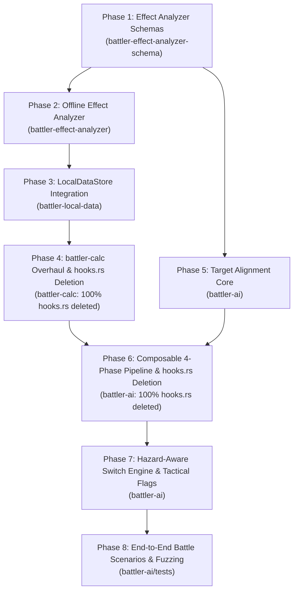
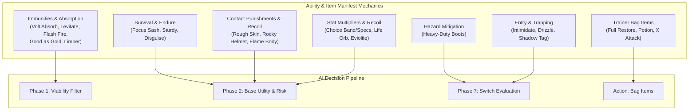

# Implementation Plan: `battler-ai` Trainer Engine Overhaul

This document details the multi-phase implementation plan for overhauling the internal architecture of **`battler-ai`** (the trainer AI engine), unifying it with **`fxlang`** effect semantics, and fixing long-standing limitations in target alignment, spread damage scoring, and decision composability.

For the full architectural rationale and design specification, see the companion document:
👉 **[trainer-ai-rehaul-design.md](trainer-ai-rehaul-design.md)**

---

## Architectural Dependency Graph

The plan is organized into 8 sequential phases designed for incremental delivery, clean crate boundaries, continuous verification, and complete elimination of both legacy `hooks.rs` files:



---

## Phase 1: Effect Analyzer Schemas & Types (`battler-effect-analyzer-schema`)

### Objective
Create a dedicated schema crate, `battler-effect-analyzer-schema`, to house all semantic effect classifications, polarity enums, action models, damage modifiers, and simulation flags. 

By keeping these types in their own schema crate (following the repository convention of `battler-service-schema` and `battler-data-service-schema`), **`battler-data` remains completely clean**, unpolluted, and strictly focused on `no_std` authentic Mon definitions and TypeScript bindings.

### Target Files
- `battler-effect-analyzer-schema/Cargo.toml` (new crate)
- `battler-effect-analyzer-schema/src/lib.rs`
- `battler-effect-analyzer-schema/src/polarity.rs`
- `battler-effect-analyzer-schema/src/target_role.rs`
- `battler-effect-analyzer-schema/src/action.rs`
- `battler-effect-analyzer-schema/src/modifier.rs`
- `battler-effect-analyzer-schema/src/requirement.rs`
- `battler-effect-analyzer-schema/src/effect_manifest.rs`
- `battler-effect-analyzer-schema/src/condition_manifest.rs`
- `battler-effect-analyzer-schema/src/ability_manifest.rs`
- `battler-effect-analyzer-schema/src/item_manifest.rs`
- `battler-effect-analyzer-schema/src/manifest_store.rs` (manifest store traits)

### Tasks
1. **Define `EffectPolarity`**:
   ```rust
   #[derive(Debug, Clone, Copy, PartialEq, Eq, Serialize, Deserialize)]
   pub enum EffectPolarity {
       Beneficial,
       Harmful,
       Neutral,
   }
   ```
2. **Define `TargetRole`**:
   ```rust
   #[derive(Debug, Clone, Copy, PartialEq, Eq, Hash, Serialize, Deserialize)]
   pub enum TargetRole {
       User,
       Ally,
       Foe,
       AllySide,
       FoeSide,
       Field,
   }
   ```
3. **Define `SemanticAction`**:
   - `Damage { category, base_power, recoil_percent, drain_percent }`
   - `StatChange { boosts }`
   - `StatusInfliction { status, chance }`
   - `StatusCure { statuses }`
   - `ApplyCondition { condition_id, is_volatile, max_stacks }`
   - `ApplySideCondition { condition_id, max_stacks }`
   - `SetFieldCondition { condition_id }`
   - `Heal { fraction }`
   - `ForceSwitch { target }`
   - `Protection`
4. **Define `EffectRequirement`**:
   - `TargetNotStatused`
   - `TargetNotCondition(String)`
   - `SideConditionUnderMaxStacks(String, u32)`
   - `WeatherNotActive(String)`
   - `TerrainNotActive(String)`
   - `StatNotCapped(Boost, i8)`
   - `HealthBelowFull`
5. **Define `AbilityManifest`**:
   - `immunities: Vec<Type>` (e.g., Electric for *Volt Absorb*, Ground for *Levitate*)
   - `absorption: Vec<(Type, HealOrBoost)>`
   - `status_immunities: Vec<String>` (e.g., `par` for *Limber*, `slp` for *Insomnia*)
   - `contact_punishment: Option<ContactPunishment>` (e.g., *Rough Skin* 1/8 damage, *Flame Body* 30% burn)
   - `survival: Option<SurvivalType>` (e.g., *Sturdy* Focus Sash effect at full HP)
   - `entry_effect: Option<SemanticAction>` (e.g., *Intimidate* $-1$ Atk on foes, *Drizzle* rain weather)
   - `trapping: Option<TrappingScope>` (e.g., *Shadow Tag*, *Arena Trap*)
6. **Define `ItemManifest`**:
   - **Held Item**:
     - `hazard_immunity: bool` (*Heavy-Duty Boots*)
     - `survival: Option<SurvivalType>` (*Focus Sash*)
     - `contact_punishment: Option<ContactPunishment>` (*Rocky Helmet*)
     - `stat_multiplier: Option<(Stat, Fraction<u64>)>` (*Choice Band*, *Eviolite*)
     - `move_lock: Option<MoveLockType>` (*Choice Scarf*, *Assault Vest*)
   - **Bag Item** (Trainer items):
     - `target: TargetRole` (User or Ally)
     - `action: SemanticAction` (Heal, StatusCure, StatChange)
     - `polarity: EffectPolarity` (Beneficial)
7. **Define `EffectManifest` and `ConditionManifest`** with full `serde` serialization.
8. **Define `ManifestStore`, `ManifestStoreByName`, and `CalcDataStore` Traits**:
   Following the exact architectural design of `battler-data-service-schema::DescriptionStore`:
   ```rust
   pub trait ManifestStore: Send + Sync {
       fn get_move_manifest(&self, id: &Id) -> Result<Option<&EffectManifest>>;
       fn get_condition_manifest(&self, id: &Id) -> Result<Option<&ConditionManifest>>;
       fn get_ability_manifest(&self, id: &Id) -> Result<Option<&AbilityManifest>>;
       fn get_item_manifest(&self, id: &Id) -> Result<Option<&ItemManifest>>;
   }

   pub trait ManifestStoreByName: ManifestStore {
       fn get_move_manifest_by_name(&self, name: &str) -> Result<Option<&EffectManifest>>;
       fn get_condition_manifest_by_name(&self, name: &str) -> Result<Option<&ConditionManifest>>;
       fn get_ability_manifest_by_name(&self, name: &str) -> Result<Option<&AbilityManifest>>;
       fn get_item_manifest_by_name(&self, name: &str) -> Result<Option<&ItemManifest>>;
   }

   /// Combined trait implemented by any data source that provides both authentic Mon data and manifests.
   pub trait CalcDataStore: battler_data::DataStoreByName + ManifestStoreByName {}
   impl<T: battler_data::DataStoreByName + ManifestStoreByName> CalcDataStore for T {}
   ```
   This ensures `battler-data` remains 100% untouched and pure `no_std`.

### Verification & High-Quality Tests
- **Unit Test: `serde_roundtrip_test`**:
  Verify every variant of `SemanticAction`, `EffectRequirement`, `AbilityManifest`, `ItemManifest`, and `EffectManifest` serializes to and from JSON without loss.
- **Unit Test: `polarity_helpers_test`**:
  Test helper predicates (`is_beneficial()`, `is_harmful()`, `inverts_with()`).
- **Unit Test: `target_role_classification_test`**:
  Test mapping from relative positions and team relationships to `TargetRole`.

---

## Phase 2: Static FXLang AST Extractor & CLI Generator (`battler-effect-analyzer`)

### Objective
Build the standalone CLI compilation tool that scans `battle-data/data/moves/gen*.json`, `conditions.json`, `abilities/gen*.json`, and `items/gen*.json`, traverses `battler::effect::fxlang::tree` ASTs, merges any explicit JSON `"ai"` overrides, and outputs precompiled manifests into `battle-data/data/manifests/`.

### Target Files
- `battler/src/effect/fxlang/mod.rs` (export `pub mod tree;` so AST nodes are publicly accessible to analyzer)
- `Cargo.toml` (add `battler-effect-analyzer` to workspace members)
- `battler-effect-analyzer/Cargo.toml` (new binary crate, top-level workspace member)
- `battler-effect-analyzer/src/main.rs`
- `battler-effect-analyzer/src/visitor.rs`
- `battler-effect-analyzer/src/extractor.rs`
- `battler-effect-analyzer/src/condition_registry.rs`
- `battler-effect-analyzer/src/ability_analyzer.rs`
- `battler-effect-analyzer/src/item_analyzer.rs`
- `battle-data/data/manifests/moves.json` (generated artifact)
- `battle-data/data/manifests/conditions.json` (generated artifact)
- `battle-data/data/manifests/abilities.json` (generated artifact)
- `battle-data/data/manifests/items.json` (generated artifact)

### Tasks
1. **Export AST Types in `battler`**:
   - In `battler/src/effect/fxlang/mod.rs`, change `mod tree;` to `pub mod tree;` to allow external crates to match and inspect `tree::Statement`, `tree::FunctionCall`, and AST expressions.
2. **Implement Multi-Generation Data & Override Deserializer**:
   - `battle-data/data/moves/` organizes moves by generation (`gen1.json`, `gen2.json`, ..., `gen9.json`) rather than single files.
   - Use `ResourceWithAi<T>` wrapper (`{ #[serde(flatten)] data: T, ai: Option<EffectManifestOverride> }`) when parsing raw JSON tables so custom `"ai"` blocks are captured alongside authentic data.
3. **Implement `ConditionRegistry`**:
   - Parses `conditions.json` and assigns polarity, scope, and stack limits:
     - Hazards (`spikes`, `toxicspikes`, `stealthrock`, `stickyweb`): `Harmful`, `SideCondition`, max stacks 1-3.
     - Screens/Support (`tailwind`, `reflect`, `lightscreen`, `auroraveil`, `safeguard`): `Beneficial`, `SideCondition`, max stacks 1.
     - Harmful Volatiles (`taunt`, `encore`, `torment`, `disable`, `confusion`, `leechseed`, `partiallytrapped`, `flinch`): `Harmful`, `Volatile`.
     - Beneficial Volatiles (`substitute`, `focusenergy`, `aquaring`): `Beneficial`, `Volatile`.
4. **Implement `FxlangAstVisitor`**:
   - Traverses statements (`tree::Statement::FunctionCall`, `tree::Statement::IfStatement`, `tree::Statement::Assignment`).
   - Maps canonical functions from `battler/src/effect/fxlang/functions.rs`:
     - `damage`, `direct_damage` $\rightarrow$ `SemanticAction::Damage` (Polarity: Harmful on target).
     - `set_status` $\rightarrow$ `SemanticAction::StatusInfliction` (Polarity: Harmful on target).
     - `cure_status` $\rightarrow$ `SemanticAction::StatusCure` (Polarity: Beneficial on target).
     - `heal`, `set_hp` $\rightarrow$ `SemanticAction::Heal` (Polarity: Beneficial on target).
     - `boost` with positive value $\rightarrow$ `SemanticAction::StatChange` (Polarity: Beneficial).
     - `boost` with negative value $\rightarrow$ `SemanticAction::StatChange` (Polarity: Harmful).
     - `add_volatile` $\rightarrow$ Look up condition in `ConditionRegistry`, inherit polarity.
     - `add_side_condition` $\rightarrow$ Look up condition in `ConditionRegistry`, inherit polarity and max stacks.
5. **Implement Ability & Item Analyzers**:
   - **Dynamic Damage Modifiers** (Eliminates `battler-calc/src/hooks.rs` hardcoding):
     - Parse `on_source_base_power` / `on_base_power` $\rightarrow$ `DamageModifier::BasePower`:
       - Abilities: *Technician*, *Adaptability*, *Tough Claws*, *Strong Jaw*, *Iron Fist*.
       - Held Items: Type-boosting items (*Charcoal*, *Mystic Water*, *Magnet*, *Silk Scarf*, *Black Belt* via `boosttypepowerby20percentitembase`), elemental gems (*Fire Gem*, *Normal Gem*).
     - Parse `on_modify_damage` / `on_source_modify_damage` $\rightarrow$ `DamageModifier::Damage`:
       - Held Items: *Life Orb* ($1.3\times$ damage + $10\%$ recoil), all 18 resist berries via `damagereducingberryitembase` (*Occa*, *Passho*, *Yache*, *Chople*, etc.).
       - Abilities: *Multiscale*, *Solid Rock*, *Filter*, *Tinted Lens*, *Neuroforce*, *Sniper*.
     - Parse `on_modify_stat` $\rightarrow$ `DamageModifier::Stat`:
       - Held Items: *Choice Band* ($1.5\times$ Atk), *Choice Specs* ($1.5\times$ SpAtk), *Eviolite* ($1.5\times$ Def/SpDef).
       - Abilities: *Huge Power*, *Pure Power*, *Fur Coat*, *Protosynthesis*, *Quark Drive*.
   - **Held Items (Defensive & Utility Mechanics)**:
     - *Focus Sash*: survival tag at $100\%$ HP.
     - *Rocky Helmet*: contact punishment ($1/6$ max HP recoil).
     - *Heavy-Duty Boots*: entry hazard immunity tag.
     - *Air Balloon*: Ground-type immunity tag.
     - *Assault Vest*: $1.5\times$ SpDef stat multiplier + status move lock.
   - **Trainer Bag Items (In-Battle Consumables)**:
     - Scan and parse bag items in `battle-data/data/items/gen*.json`:
       - Healing Items (*Potion*, *Super Potion*, *Hyper Potion*, *Max Potion*, *Full Restore*) $\rightarrow$ `BagItemManifest { target: TargetRole::Ally, action: SemanticAction::Heal, polarity: EffectPolarity::Beneficial }`.
       - Status Cures (*Antidote*, *Awakening*, *Burn Heal*, *Full Heal*) $\rightarrow$ `BagItemManifest { target: TargetRole::Ally, action: SemanticAction::StatusCure, polarity: EffectPolarity::Beneficial }`.
       - Revives (*Revive*, *Max Revive*) $\rightarrow$ `BagItemManifest { target: TargetRole::FaintedAlly, action: SemanticAction::Revive, polarity: EffectPolarity::Beneficial }`.
       - Battle Stat Boosters (*X Attack*, *X Defense*, *X Speed*, *Dire Hit*) $\rightarrow$ `BagItemManifest { target: TargetRole::Ally, action: SemanticAction::StatChange, polarity: EffectPolarity::Beneficial }`.
   - **Non-Scalar Mechanics & Traits in Abilities**:
     - Parse `on_try_hit` in abilities to extract type immunities (*Volt Absorb*, *Water Absorb*, *Levitate*, *Flash Fire*) and status immunities (*Limber*, *Insomnia*).
     - Parse `on_damage` / `on_damaging_hit` for contact punishments (*Rough Skin*, *Iron Barbs*, *Flame Body*) and survival (*Sturdy*).
     - Parse `on_start` for entry abilities (*Intimidate*, *Drizzle*, *Drought*, *Electric Surge*).
6. **Declarative Base Data Fallback**:
   - For moves without callbacks (62.6% of moves), construct actions directly from `category`, `base_power`, `hit_effect`, and `secondary_effects`.
7. **Override Mechanism**:
   - If move, ability, or item JSON has an `"ai"` block, override/overlay the extracted manifest.
8. **CLI Interface**:
   - `cargo run -p battler-effect-analyzer` (generates manifests into `battle-data/data/manifests/`).
   - `cargo run -p battler-effect-analyzer -- --check` (validates committed manifests match data; returns exit code 1 if stale).

### Verification & High-Quality Tests
- **AST Unit Tests (`visitor_test.rs`)**:
  - Test statement parser on:
    - `"heal: $target expr($target.base_max_hp / 2)"` $\rightarrow$ `Heal(1/2, Beneficial)`.
    - `"set_status: $target slp"` $\rightarrow$ `StatusInfliction("slp", Harmful)`.
    - `"boost: $target atk -2"` $\rightarrow$ `StatChange(Atk -2, Harmful)`.
    - `"add_side_condition: $side tailwind"` $\rightarrow$ `ApplySideCondition("tailwind", Beneficial, max: 1)`.
    - `"add_side_condition: $side spikes"` $\rightarrow$ `ApplySideCondition("spikes", Harmful, max: 3)`.
- **Ability & Item Extraction Tests (`ability_item_analyzer_test.rs`)**:
  - Verify *Technician* extracts `DamageModifier::BasePower(3/2)` with `BasePowerMax(60)`.
  - Verify *Life Orb* extracts `DamageModifier::Damage(13/10)`.
  - Verify *Charcoal* extracts `DamageModifier::BasePower(6/5)` for `Type::Fire`.
  - Verify *Volt Absorb* extracts Electric immunity + Heal.
  - Verify *Limber* extracts Paralysis status immunity.
  - Verify *Rocky Helmet* extracts Contact Punishment (1/6 damage).
  - Verify *Heavy-Duty Boots* extracts Hazard Immunity.
  - Verify *Focus Sash* extracts Survival at full HP.
- **Golden Snapshot Tests (`snapshot_test.rs`)**:
  - Runs against all 936 moves, 300+ abilities, and 400+ items in the repository.
  - Verifies that 100% produce valid manifests without parse errors.
- **CI Check Test**:
  - Automated test verifying that `cargo run -p battler-effect-analyzer -- --check` passes on clean repository.

---

## Phase 3: Local Data Store Integration (`battler-local-data`)

### Objective
Integrate precompiled manifests into `LocalDataStore` by implementing `ManifestStore` and `ManifestStoreByName` so runtime engines can query manifests efficiently by ID or name without altering `battler-data`.

### Target Files
- `battler-local-data/Cargo.toml` (add `battler-effect-analyzer-schema = { workspace = true }`)
- `battler-local-data/src/lib.rs` (implement `ManifestStore` and `ManifestStoreByName` on `LocalDataStore`)
- `battler-test-utils/src/local_data_store.rs`

### Tasks
1. **Implement `ManifestStore` & `ManifestStoreByName` on `LocalDataStore`**:
   - `battler-data` remains 100% untouched and pure `no_std`.
   - Add manifest storage fields to `LocalDataStore`:
     ```rust
     pub move_manifests: HashMap<Id, EffectManifest>,
     pub condition_manifests: HashMap<Id, ConditionManifest>,
     pub ability_manifests: HashMap<Id, AbilityManifest>,
     pub item_manifests: HashMap<Id, ItemManifest>,
     move_manifests_by_name: RwLock<HashMap<String, Id>>,
     ```
   - In `LocalDataStore::new()`, load `battle-data/data/manifests/moves.json`, `conditions.json`, `abilities.json`, and `items.json`.
   - Implement `ManifestStore` and `ManifestStoreByName` for `LocalDataStore`.
2. **Graceful Fallback**:
   - If a manifest is missing for a dynamic or test move, synthesize a baseline manifest on the fly from `MoveData` via `EffectManifest::from_move_data(&move_data)`.

### Verification & High-Quality Tests
- **Integration Test (`manifest_store_test.rs`)**:
  - Load `LocalDataStore` using `static_local_data_store()`.
  - Assert that `get_move_manifest_by_name("Earthquake")` returns expected damage action.
  - Assert that `get_move_manifest_by_name("Heal Pulse")` returns `Beneficial` heal action.
  - Assert that `get_ability_manifest(&Id::from("voltabsorb"))` returns Electric immunity and heal.
  - Assert that `get_item_manifest(&Id::from("heavydutyboots"))` returns hazard immunity.
  - Assert that `get_move_manifest_by_name("Spikes")` returns `ApplySideCondition` with `max_stacks: 3`.

---

## Phase 4: `battler-calc` Calculator Overhaul & 100% `hooks.rs` Deletion (`battler-calc`)

### Objective
Eliminate all 1,457 lines of hardcoded macros and static function pointer tables in `battler-calc/src/hooks.rs`. Refactor `battler-calc/src/simulate.rs` into a pure mathematical formula engine that reads `DamageModifier`s, `FixedDamage`, `ImmunityRule`, and `EffectFlag`s directly from manifests via `CalcDataStore`. Update `battler-calc/battler-calc-client-util` to support the overhauled input.

### Target Files
- `battler-calc/Cargo.toml` (add `battler-effect-analyzer-schema = { workspace = true }`)
- `battler-calc/src/hooks.rs` (**DELETED completely: 1,457 lines removed**)
- `battler-calc/src/lib.rs` (remove `pub(crate) mod hooks;`, re-export `CalcDataStore`)
- `battler-calc/src/simulate.rs` (replace hook lookups with typed manifest loops)
- `battler-calc/battler-calc-client-util/Cargo.toml` (add `battler-effect-analyzer-schema = { workspace = true }`)
- `battler-calc/battler-calc-client-util/src/lib.rs` (update `move_simulator_input_from_battle_state` to accept `&dyn CalcDataStore`)

### Tasks
1. **Dynamic Base Power & Stat Modifiers**:
   - In `simulate.rs`, replace calls to `hooks::MODIFY_BASE_POWER_HOOKS` with an iterator over `manifest.damage_modifiers.iter().filter(|m| m.event == DamageModifierEvent::BasePower)`.
   - Replace `hooks::MODIFY_*_STAT_HOOKS` with `DamageModifierEvent::Stat(stat)`.
   - Replace `hooks::MODIFY_DAMAGE_HOOKS` with `DamageModifierEvent::Damage`.
2. **Fixed Damage Resolution**:
   - In `simulate.rs`, replace `hooks::APPLY_FIXED_DAMAGE_HOOKS` with a match on `manifest.fixed_damage` (`FixedDamage::Constant(val)`, `FixedDamage::Level`, `FixedDamage::FractionTargetCurrentHp(num, den)`).
3. **Declarative Failure & Immunity Checks**:
   - Replace `hooks::FAIL_MOVE_BEFORE_HIT_HOOKS` with engine rules:
     - Priority move blocked if `field.has_terrain(["Psychic Terrain"])` and defender is grounded.
     - OHKO move fails if defender has `AbilityManifest { survival: Some(SurvivalType::Sturdy) }`.
     - Elemental immunity: check defender `AbilityManifest.type_immunities` (*Volt Absorb*, *Flash Fire*, *Levitate*).
4. **Declarative State Mutations (`EffectFlag`)**:
   - Screen breaking: if `manifest.breaks_screens`, clear Reflect/Light Screen/Aurora Veil (*Brick Break*).
   - Weather suppression: if attacker or defender has `AbilityManifest.suppresses_weather`, treat weather as None (*Air Lock*, *Cloud Nine*).
   - Item weather suppression: if mon has `ItemManifest.weather_suppressed_for_holder`, ignore weather effects on that mon (*Utility Umbrella*).
   - Item suppression: if defender has condition `"Embargo"`, treat item as None.
   - Ability suppression: if defender has condition `"Gastro Acid"`, treat ability as None.
5. **Update `battler-calc-client-util`**:
   - Update `move_simulator_input_from_battle_state<'d>` in `battler-calc/battler-calc-client-util/src/lib.rs` to accept `data: &'d dyn CalcDataStore`.
6. **Delete `battler-calc/src/hooks.rs`**:
   - Remove the file and all internal references.

### Comprehensive `battler-calc` Verification & Testing Plan (250+ Tests)
Because `battler-calc/src/hooks.rs` is deleted 100%, the calculator must be proven mathematically sound and bug-free across all battle engine interactions before building AI scoring on top of it.

Rather than relying solely on a handful of smoke tests, we establish an **exhaustive test matrix of over 250 distinct unit and integration tests** organized into 8 dedicated integration files in `battler-calc/tests/`:

1. **Existing Regression Suite (45 Tests)**:
   - Run `cargo test -p battler-calc --lib` to ensure all 45 inline tests in `simulate.rs` continue to pass with zero regressions.
2. **Base Power Modifiers (`tests/base_power_modifiers_test.rs`)**:
   - *Technician*: verifies moves with base power $\le 60$ (*Bullet Punch*, *Aerial Ace*) receive $1.5\times$ multiplier; moves $> 60$ (*Iron Head*) receive $1.0\times$.
   - Type-Powering Items: verifies *Charcoal*, *Mystic Water*, *Magnet*, *Silk Scarf*, *Black Belt* apply exact $1.2\times$ multiplier to matching moves and $1.0\times$ to non-matching.
   - Elemental Gems: verifies *Fire Gem*, *Normal Gem* apply $1.3\times$ multiplier.
   - Terrains: verifies grounded attackers receive $1.3\times$ boost in Electric, Grassy, and Psychic Terrain; verifies Misty Terrain reduces Dragon-type damage by $0.5\times$.
   - Abilities: verifies *Tough Claws* ($1.3\times$ on contact), *Strong Jaw* ($1.5\times$ on bite), *Iron Fist* ($1.2\times$ on punch), *Mega Launcher* ($1.5\times$ on pulse), *Reckless* ($1.2\times$ on recoil), *Sheer Force* ($1.3\times$ + strips secondary effects).
3. **Stat Modifiers Suite (`tests/stat_modifiers_test.rs`)**:
   - Stat Stages: tests full $-6$ to $+6$ stage curve for Attack, Defense, SpAtk, SpDef, and Speed, matching authentic fraction formulas ($\frac{2}{8}, \frac{2}{7}, \dots, \frac{8}{2}$).
   - Held Items: tests *Choice Band* ($1.5\times$ Atk), *Choice Specs* ($1.5\times$ SpAtk), *Eviolite* ($1.5\times$ Def & SpDef on unevolved Mons like Chansey and Dusclops), *Assault Vest* ($1.5\times$ SpDef).
   - Abilities: tests *Huge Power* / *Pure Power* ($2.0\times$ Atk), *Fur Coat* ($2.0\times$ Def against physical), *Ice Scales* ($0.5\times$ special damage taken).
   - Burn & Status: tests burn halving physical damage; tests *Guts* and *Facade* ignoring the burn reduction.
   - Paradox Abilities: tests *Protosynthesis* and *Quark Drive* boosting highest stat by $1.3\times$ ($1.5\times$ for Speed).
4. **Final Damage Modifiers Suite (`tests/final_damage_modifiers_test.rs`)**:
   - *Life Orb*: verifies $1.3\times$ damage dealt and $10\%$ max HP recoil damage on attacker.
   - *Multiscale* / *Shadow Shield*: verifies $0.5\times$ damage taken at $100\%$ HP, and $1.0\times$ taken when HP is $\le 99\%$.
   - Damage Reduction Abilities: tests *Filter*, *Solid Rock*, *Prism Armor* reducing super-effective damage by $0.75\times$.
   - Damage Boosting Abilities: tests *Tinted Lens* doubling damage on resisted moves; *Sniper* increasing crit multiplier from $1.5\times$ to $2.25\times$.
   - Screens: verifies *Reflect* and *Light Screen* ($0.5\times$ singles, $0.66\times$ doubles); verifies *Brick Break* and *Psychic Fangs* destroy screens and deal full damage in a single turn.
   - All 18 Resist Berries: tests *Occa*, *Passho*, *Wacan*, *Rindo*, *Yache*, *Chople*, *Kebia*, *Shuca*, *Coba*, *Payapa*, *Tanga*, *Charti*, *Kasib*, *Haban*, *Colbur*, *Babiri*, *Chilan*, *Roseli* applying $0.5\times$ reduction on super-effective hit; verifies *Ripen* quadruples reduction to $0.25\times$.
5. **Fixed & Special Damage Moves (`tests/fixed_and_special_damage_test.rs`)**:
   - Level Scaling: verifies *Seismic Toss* and *Night Shade* deal exact damage equal to attacker level (level 5 deals 5, level 50 deals 50, level 100 deals 100), ignoring offensive/defensive stats and crits.
   - Flat Damage: verifies *Dragon Rage* deals 40 damage; *Sonic Boom* deals 20 damage.
   - Fractional HP Damage: verifies *Super Fang* and *Nature's Madness* deal exact $\lfloor \text{Target HP} / 2 \rfloor$.
   - Variable Stat Moves: verifies *Psyshock*, *Psystrike*, and *Secret Sword* use user SpAtk against target physical Def; verifies *Body Press* uses user Def stat and Def boosts; verifies *Foul Play* uses target Atk stat and target Atk boosts.
6. **Dynamic Move Transformations (`tests/dynamic_move_transformation_test.rs`)**:
   - *Weather Ball*: verifies Normal 50 BP (clear), Fire 100 BP (Sun), Water 100 BP (Rain), Ice 100 BP (Snow), Rock 100 BP (Sand).
   - *Terrain Pulse*: verifies Normal 50 BP (no terrain), Electric/Grass/Psychic/Water 100 BP in respective terrains.
   - *Flying Press*: verifies dual Fighting + Flying effectiveness against all 18 single types and dual typings.
   - *Freeze-Dry*: verifies super-effective $2.0\times$ hit on mono-Water and $4.0\times$ on Water/Ground.
7. **Immunities & Grounded State (`tests/immunities_and_grounded_test.rs`)**:
   - Elemental Absorptions: tests *Volt Absorb* (heals 25%), *Lightning Rod* (SpAtk +1), *Flash Fire* (Fire immune + boost), *Water Absorb* / *Dry Skin* (heals 25%), *Sap Sipper* (Atk +1), *Earth Eater* (heals 25%).
   - Ground Immunities: tests Flying-types, *Levitate*, and *Air Balloon* taking 0 damage from Ground attacks.
   - Grounding Effects: tests *Iron Ball*, *Gravity*, *Ingrain*, and *Smack Down* grounding targets and removing Ground immunity.
   - Priority Protection: tests *Psychic Terrain* failing priority moves against grounded targets while allowing priority moves against airborne targets.
   - Sound & Ball moves: tests *Soundproof* blocking sound moves and *Bulletproof* blocking ball/bomb moves.
8. **Multi-Hit, Recoil & Drain (`tests/multi_hit_and_recoil_test.rs`)**:
   - Multi-hit Distribution: tests 2-5 hit moves (*Bullet Seed*, *Icicle Spear*) with average roll distribution and guaranteed 5 hits with *Skill Link*.
   - Ramping Moves: tests *Triple Axel* (20, 40, 60 BP) and *Population Bomb* (up to 10 hits).
   - Recoil Moves: tests *Brave Bird* (33% recoil), *Head Smash* (50% recoil), *Struggle* (25% max HP recoil).
   - Drain Moves: tests *Giga Drain* and *Drain Punch* restoring 50% of damage dealt; tests *Big Root* boosting heal amount.

---

## Phase 5: Target Alignment Matrix & Net Spread Utility (`battler-ai`)

### Objective
Implement the mathematical core for evaluating recipient relationships and multi-target spread utility in `battler-ai`. This eliminates the hardcoded `-30` ally penalty and fixes spread move averaging.

### Target Files
- `battler-ai/src/trainer/alignment.rs` (new module)
- `battler-ai/src/trainer/spread.rs` (new module)
- `battler-ai/src/trainer/context.rs` (expose target roles)

### Tasks
1. **Implement `TargetAlignmentMatrix`**:
   ```rust
   pub struct TargetAlignmentMatrix;
   
   impl TargetAlignmentMatrix {
       pub fn evaluate(role: TargetRole, polarity: EffectPolarity) -> AlignmentEvaluation {
           match (role, polarity) {
               (TargetRole::Foe, EffectPolarity::Harmful) => AlignmentEvaluation::Desirable,
               (TargetRole::Foe, EffectPolarity::Beneficial) => AlignmentEvaluation::SeverePenalty(100),
               (TargetRole::Ally, EffectPolarity::Harmful) => AlignmentEvaluation::SeverePenalty(100),
               (TargetRole::Ally, EffectPolarity::Beneficial) => AlignmentEvaluation::Desirable,
               (TargetRole::User, EffectPolarity::Beneficial) => AlignmentEvaluation::Desirable,
               (TargetRole::User, EffectPolarity::Harmful) => AlignmentEvaluation::Penalty(30), // e.g. recoil/self-debuff
               (TargetRole::FoeSide, EffectPolarity::Harmful) => AlignmentEvaluation::Desirable, // hazards
               (TargetRole::FoeSide, EffectPolarity::Beneficial) => AlignmentEvaluation::SeverePenalty(100),
               (TargetRole::AllySide, EffectPolarity::Beneficial) => AlignmentEvaluation::Desirable, // screens
               (TargetRole::AllySide, EffectPolarity::Harmful) => AlignmentEvaluation::SeverePenalty(100),
               (_, EffectPolarity::Neutral) => AlignmentEvaluation::Contextual,
           }
       }
   }
   ```
2. **Implement `NetSpreadUtility`**:
   $$\text{NetUtility} = \sum_{f \in \text{Foes}} \text{Utility}(f) - \sum_{a \in \text{Allies}} \text{HarmPenalty}(a) + \sum_{a \in \text{Allies}} \text{BenefitUtility}(a)$$
3. **Immunity Awareness in Friendly Fire**:
   - If an ally partner is hit by *Earthquake*, but the ally is Flying-type, has *Levitate*, or has *Telepathy*, the harm penalty is $0$.
   - If an ally partner is hit by *Surf*, but has *Water Absorb* or *Dry Skin*, convert the hit to a beneficial utility!

### Target Alignment & Spread Verification (35+ Tests)
- **Unit Test: `target_alignment_matrix_test`**:
  Verify all combinations of `(TargetRole, EffectPolarity)` produce correct polarity evaluations.
- **Unit Test: `friendly_fire_penalty_test`**:
  - Using *Sludge Bomb* on partner Mon receives $-100$ alignment penalty.
  - Using *Heal Pulse* on partner Mon at $40\%$ HP receives $+60$ beneficial utility.
  - Using *Heal Pulse* on opponent receives $-100$ penalty.
- **Unit Test: `net_spread_utility_doubles_test`**:
  - Doubles battle with User, Ally, Foe 1, Foe 2.
  - Scenario 1: *Earthquake* hits Foe 1 (+50), Foe 2 (+50), Ally vulnerable (-120). Net: $-20$ (Rejected).
  - Scenario 2: *Earthquake* hits Foe 1 (+50), Foe 2 (+50), Ally is Zapdos (Flying/Immune, penalty 0). Net: $+100$ (Selected!).
  - Scenario 3: *Surf* hits Foe 1 (+40), Foe 2 (+40), Ally has *Water Absorb* (+30 heal). Net: $+110$ (Synergy reward!).

---

## Phase 6: Composable 4-Phase Pipeline, Explainable Scoring & 100% AI `hooks.rs` Deletion (`battler-ai`)

### Objective
Replace the broken early-break loop in `trainer.rs` with the structured 4-phase evaluation pipeline, implement `ScoreBreakdown`, and **completely delete `battler-ai/src/trainer/hooks.rs`** (300 lines removed).

### Target Files
- `battler-ai/src/trainer/pipeline/mod.rs` (new module)
- `battler-ai/src/trainer/pipeline/viability.rs` (Phase 1)
- `battler-ai/src/trainer/pipeline/utility.rs` (Phase 2)
- `battler-ai/src/trainer/pipeline/spread.rs` (Phase 3)
- `battler-ai/src/trainer/pipeline/tactics.rs` (Phase 4)
- `battler-ai/src/trainer/pipeline/breakdown.rs` (`ScoreBreakdown`)
- `battler-ai/src/trainer/trainer.rs` (integrate pipeline)
- `battler-ai/src/trainer/hooks.rs` (**DELETED completely: 300 lines removed**)

### Tasks
1. **Define `ViabilityRule` Trait (Phase 1)**:
   ```rust
   pub enum ViabilityResult {
       Valid,
       Prune(&'static str),
   }
   
   pub trait ViabilityRule: Send + Sync {
       fn evaluate(&self, context: &RuleContext, manifest: &EffectManifest) -> Result<ViabilityResult>;
   }
   ```
   Implement rules:
   - `TypeImmunityRule`: checks type immunity without bypass.
   - `StatusAlreadyAppliedRule`: prunes status moves if target already has non-volatile status.
   - `VolatileAlreadyAppliedRule`: prunes condition if target already has it.
   - `SideConditionMaxStacksRule`: prunes hazard/screen if current stacks $\ge$ `max_stacks`.
   - `StatCapRule`: prunes stat buff if $+6$, stat debuff if $-6$.
   - `FullHealthHealRule`: prunes heal moves if target is at $100\%$ HP.
   - `TauntRule`: prunes status moves if user is taunted.
2. **Define `UtilityRule` Trait (Phase 2)**:
   ```rust
   pub trait UtilityRule: Send + Sync {
       fn evaluate(&self, context: &RuleContext, manifest: &EffectManifest, breakdown: &mut ScoreBreakdown) -> Result<()>;
   }
   ```
   Implement rules:
   - `DamageUtilityRule`:
     - Consumes the 16 simulated damage rolls (`RangeDistribution<u64>`) calculated by `battler-calc`.
     - **KO Thresholds**:
       - Guaranteed KO ($100\%$): If `min_damage >= target_hp`, awards a $+50$ priority bonus.
       - Roll to KO ($50\%-90\%$): Awards proportional bonus based on faint probability.
     - **Survival Caps & Multi-Hit Priority**:
       - If defender has *Focus Sash* or *Sturdy* at $100\%$ HP (detected via `ItemManifest` / `AbilityManifest`), single-hit damage is capped at `target_hp - 1`, stripping the guaranteed KO bonus.
       - Multi-hit moves (*Scale Shot*, *Bullet Seed*) bypass the cap on hits 2+ and receive the KO bonus.
     - **Contact & Recoil Risk Accounting**:
       - If defender has *Rocky Helmet*, *Rough Skin*, or *Iron Barbs* and move has `contact: true`, applies a severe penalty if recoil puts user in KO range.
       - If move has recoil (*Brave Bird*, *Head Smash*, *Life Orb*), penalizes if user health is in critical range.
   - `StatusUtilityRule`: calculates utility of inflicting burn/paralyze/sleep on foe.
   - `StatModificationUtilityRule`: calculates utility of boosting user/ally or lowering foe stats.
   - `HealUtilityRule`: scales healing utility by target's missing HP fraction.
   - `TargetAlignmentRule`: applies penalties/rewards from `TargetAlignmentMatrix`.
3. **Phase 3 Spread Aggregator**:
   Combines hit target evaluations using `NetSpreadUtility`.
4. **Implement `ScoreBreakdown`**:
   Collects component scores, viability status, and explainability text.
5. **Update `trainer.rs` & Delete `hooks.rs`**:
   - Replace `modify_move_score_with_hooks` with `PipelineExecutor::evaluate_move`.
   - Delete `battler-ai/src/trainer/hooks.rs` entirely.

### Comprehensive `battler-ai` Pipeline Verification & Testing Plan (60+ Tests)
To guarantee that the AI decision pipeline operates correctly across single and multi-turn decisions, we implement 4 dedicated integration test files in `battler-ai/tests/` totaling over 60 granular test functions:

1. **Viability Pruning Suite (`tests/viability_pruning_test.rs`)**:
   - Status Redundancy: verifies *Spore* / *Sleep Powder* is pruned against sleeping target; *Thunder Wave* is pruned against paralyzed or Ground-type target; *Will-O-Wisp* is pruned against burned or Fire-type target.
   - Volatile Redundancy: verifies *Substitute* is pruned if user already has a Substitute; *Leech Seed* is pruned if target is already seeded or is Grass-type.
   - Stack Caps: verifies *Spikes* is pruned if 3 layers are up; *Toxic Spikes* is pruned if 2 layers are up; *Stealth Rock*, *Reflect*, *Light Screen*, *Aurora Veil*, *Tailwind* are pruned if already active on side.
   - Stat Stage Caps: verifies stat buffing moves (*Swords Dance*, *Calm Mind*) are pruned if user stat is $+6$; debuff moves (*Charm*, *Screech*) are pruned if target stat is $-6$.
   - Recovery at Max HP: verifies *Recover*, *Roost*, *Soft-Boiled*, *Slack Off* are pruned if user HP is $100\%$.
   - Taunt Suppression: verifies all status moves are pruned if user is affected by Taunt.
   - Ability Blocks: verifies status moves are pruned against target with *Good as Gold*; sound moves pruned against *Soundproof*.
2. **KO Thresholds & Focus Sash Bypass (`tests/damage_utility_ko_test.rs`)**:
   - Guaranteed KO vs. Overkill: given Move A (85-100% damage, 100% accuracy) and Move B (95-115% damage, 85% accuracy), AI selects Move A because its minimum roll guarantees the KO without accuracy risk.
   - Probabilistic KO: AI calculates faint probability from `RangeDistribution` and scales utility smoothly between 50% and 90% KO odds.
   - *Focus Sash* & *Sturdy* Damage Cap:
     - When facing a full HP target with *Focus Sash* or *Sturdy*, single-hit moves (*Flamethrower*, *Hydro Pump*) have their KO bonus stripped because damage is capped at `target_hp - 1`.
     - Multi-hit moves (*Bullet Seed*, *Scale Shot*, *Icicle Spear*) calculate that hits 2+ will faint the 1 HP survivor, retaining full guaranteed KO bonus.
   - *Disguise* / *Ice Face*: AI avoids burning Z-moves or high-drawback moves against unbroken *Disguise*.
3. **Contact & Recoil Risk Accounting (`tests/contact_recoil_risk_test.rs`)**:
   - *Rocky Helmet* + *Iron Barbs* Trap:
     - User at $18\%$ HP facing Ferrothorn with *Rocky Helmet* and *Iron Barbs*.
     - Evaluates *Close Combat* (deals 100% damage to Ferrothorn, but inflicts $29\%$ contact recoil to user $\rightarrow$ self-KO).
     - Evaluates *Aura Sphere* / *Flamethrower* (non-contact $\rightarrow$ safe KO).
     - Asserts AI heavily penalizes *Close Combat* (-100 risk penalty) and selects the non-contact move.
   - Recoil Risk: user at $10\%$ HP penalizes *Brave Bird* / *Head Smash* / *Flare Blitz* if recoil is fatal, preferring a secondary attack or priority move.
   - *Life Orb* Recoil: user with *Life Orb* at $5\%$ HP avoids attacking unless the attack wins the entire match.
4. **Explainable Scoring Breakdown (`tests/score_breakdown_test.rs`)**:
   - Verifies `ScoreBreakdown` captures exact numerical contributions for:
     - `base_damage_score`
     - `status_utility_score`
     - `target_alignment_penalty`
     - `tactical_bonuses`
     - `total_score`
   - Asserts `breakdown.to_string()` produces transparent, human-readable logging for automated debugging.

---

## Phase 7: Hazard-Aware Switch Engine & Tactical Flags (`battler-ai`)

### Objective
Enhance switch evaluation to factor in entry hazard damage (*Stealth Rock*, *Spikes*), entry abilities (*Intimidate*, weather setters), and implement all behavioral flags in `TrainerFlag`.

### Target Files
- `battler-ai/src/trainer/switching.rs` (new module)
- `battler-ai/src/trainer/pipeline/tactics.rs` (tactical pipeline phase)
- `battler-ai/src/trainer/trainer.rs` (update `calculate_match_up_score` and `switch`)

### Tasks
1. **Implement `HazardDamageCalculator`**:
   - Calculates exact incoming damage fraction on a bench Mon:
     - *Stealth Rock*: type effectiveness against Rock $\times 12.5\%$.
     - *Spikes*: $12.5\%$ (1 layer), $16.6\%$ (2 layers), $25\%$ (3 layers) if grounded.
     - *Toxic Spikes*: inflicts Poison / Toxic if grounded (cured if Poison-type).
     - *Sticky Web*: $-1$ Speed stage if grounded.
     - Item check: *Heavy-Duty Boots* ignores all hazards!
2. **Implement `EntryAbilityBonus`**:
   - Calculates score modifier for entry abilities (*Intimidate*, *Drizzle*, *Drought*, *Electric Surge*, *Grassy Surge*, *Psychic Surge*, *Misty Surge*).
3. **Implement Active Mon Faint Risk**:
   - If active Mon is outsped and in $100\%$ KO range of opponent's fastest move, increase the baseline switch incentive.
4. **Composite Switch Score**:
   ```rust
   net_switch_score = raw_matchup_score - hazard_damage_penalty + entry_ability_bonus
   ```
5. **Implement Phase 4 Tactical Rules Conditioned on `TrainerFlag`**:
   - `TrainerFlag::SetUpFirstTurn`: If turn count == 1, add $+40$ utility bonus to hazards (*Stealth Rock*, *Spikes*) and screens (*Reflect*, *Light Screen*, *Tailwind*).
   - `TrainerFlag::EvaluateAttackDamage`: Adds $+50$ bonus if a move has $\ge 90\%$ probability to faint the target this turn.
   - `TrainerFlag::BenefitPartner`: Adds $+30$ weight to ally-benefiting support moves (*Helping Hand*, *Heal Pulse*, *Coaching*) in double battles.
   - `TrainerFlag::ConsiderHealth`: If user HP $< 35\%$, boosts healing moves and priority moves; penalizes moves with crash damage or high recoil.
   - `TrainerFlag::SetUpWeather`: Boosts weather-setting moves if the team has weather synergy abilities (*Swift Swim*, *Chlorophyll*, *Sand Rush*).
   - `TrainerFlag::HarassTheOpponent`: Boosts disruptive moves (*Taunt*, *Encore*, *Will-O-Wisp*, *Thunder Wave*).

### Switch Engine & Tactical Flags Verification (45+ Tests)
- **Unit Test: `hazard_damage_calculation_test`**:
  - Charizard into Stealth Rock takes $50\%$ damage.
  - Ferrothorn (Steel/Grass) takes $6.25\%$ damage.
  - Flying Mon ignores Spikes.
  - Mon holding Heavy-Duty Boots takes $0\%$ damage from all hazards.
  - Poison-type absorbs Toxic Spikes.
- **Integration Test: `switch_avoidance_on_lethal_hazard_test`**:
  - AI considers switching to Charizard at $40\%$ HP with Stealth Rock on field.
  - Hazard penalty prevents the suicidal switch.
- **Integration Test: `intimidate_switch_in_test`**:
  - AI prioritizes switching in Gyarados (*Intimidate*) against a dangerous physical attacker.
- **Scenario Test: `setup_first_turn_flag_test`**:
  - Turn 1: Skarmory chooses *Stealth Rock* over *Brave Bird*.
  - Turn 2: With rocks up, Skarmory attacks.
- **Scenario Test: `evaluate_attack_damage_ko_priority_test`**:
  - Opponent at $20\%$ HP. AI chooses *Flamethrower* (guaranteed KO) over *Will-O-Wisp*.
- **Scenario Test: `benefit_partner_doubles_test`**:
  - Low-HP partner: AI partner uses *Heal Pulse* or *Helping Hand* instead of attacking.
- **Scenario Test: `trick_room_speed_control_test`**:
  - In Trick Room, AI recognizes slow Mon moves first and avoids Speed-lowering moves on foes.

---

## Deep Dive: How Abilities and Items Affect AI Decision-Making

Abilities and held items are fundamental to battle dynamics. Rather than treating them as special-case hacks in the AI, the new semantic architecture incorporates them across 5 core evaluation hooks:



### 1. Immunities, Absorptions & Redirections (Phase 1: Viability)
- **Type Immunities**: If the target has an active ability granting immunity (*Levitate* for Ground, *Flash Fire* for Fire, *Volt Absorb* / *Lightning Rod* for Electric, *Water Absorb* / *Dry Skin* / *Storm Drain* for Water, *Sap Sipper* for Grass):
  - Phase 1 prunes the move (Score = 0) unless the user's ability or move ignores immunities (*Mold Breaker*, *Teravolt*, *Turboblaze*).
  - In doubles: *Lightning Rod* and *Storm Drain* automatically redirect single-target Electric/Water moves to the bearer, which the AI factors into targeting.
- **Status Immunities**: *Limber* (immune to Paralysis), *Immunity* (immune to Poison), *Insomnia* / *Vital Spirit* (immune to Sleep), *Oblivious* (immune to Taunt/Attract), *Good as Gold* (immune to all status moves).
  - The AI prunes *Thunder Wave* against a *Limber* target, or *Taunt* against a *Good as Gold* target.
- **Doubles Synergy Exception**: If the ally partner has *Water Absorb* and is low on HP, using *Surf* or a Water move on the partner is evaluated as **Beneficial healing**, not friendly fire!

### 2. Contact Punishments, Recoil & Risk (Phase 2: Utility)
- **Punishment Abilities**: *Rough Skin* / *Iron Barbs* (deals $1/8$ max HP recoil to contact attackers), *Flame Body* (30% burn chance), *Static* (30% paralysis chance), *Poison Point*, *Mummy*.
- **Held Items**: *Rocky Helmet* (deals $1/6$ max HP recoil on contact).
- **AI Decision Impact**:
  - The AI checks `move.flags.contains(MoveFlag::Contact)`.
  - When facing a *Rocky Helmet* + *Iron Barbs* Ferrothorn:
    - A contact move (*Close Combat*) would deal severe damage to the foe, but inflict $29\%$ recoil damage on the user. If the user is at $20\%$ HP, the move would result in a self-KO!
    - The AI heavily penalizes contact moves when low on health and favors non-contact alternatives (*Flamethrower*, *Aura Sphere*).

### 3. Survival Items & Damage Caps (Phase 2 & Phase 4)
- **Focus Sash & Sturdy**: At $100\%$ HP, lethal damage is capped at leaving the defender with 1 HP.
  - The AI checks `target.health_fraction() == 1.0` and `target.item == FocusSash || target.ability == Sturdy`.
  - A single-hit lethal move (*Close Combat*) will leave the target alive with 1 HP, meaning it is NOT a guaranteed KO.
  - Multi-hit moves (*Scale Shot*, *Bullet Seed*, *Icicle Spear*) are heavily favored because hit 1 breaks the Sash/Sturdy and hit 2+ scores the KO!

### 4. Hazard Mitigation, Entry Abilities & Trapping (Phase 6: Switching)
- **Heavy-Duty Boots**: Grants complete immunity to entry hazards (*Stealth Rock*, *Spikes*, *Toxic Spikes*, *Sticky Web*).
  - A Charizard holding *Heavy-Duty Boots* takes $0\%$ hazard damage upon switching in rather than $50\%$. The AI factors this in during switch candidate scoring.
- **Entry Abilities**:
  - *Intimidate*: Drops opponent's Attack stage by 1 upon entry. Adds $+30$ utility bonus when switching into a physical attacker.
  - Weather/Terrain Setters (*Drizzle*, *Drought*, *Electric Surge*, *Grassy Surge*): Adds a tactical bonus if the incoming weather/terrain activates active teammate abilities (*Swift Swim*, *Chlorophyll*, *Quark Drive*).
- **Trapping Abilities**:
  - *Shadow Tag*, *Arena Trap*, *Magnet Pull*.
  - If the opponent has *Shadow Tag*, the AI prunes all switch choices for non-Ghost teammates.

### 5. Trainer Bag Items (Single-Player Trainer Battles)
For trainer battles with items enabled (`TrainerFlag::UseItems`):
- Healing items (*Potion*, *Super Potion*, *Hyper Potion*, *Max Potion*, *Full Restore*):
  - Target: `User` (or `Ally` in doubles).
  - Polarity: `Beneficial`.
  - Evaluated in the same decision pool as moves: if the active Mon is a primary win condition, at $< 25\%$ HP, and outspeeds the foe next turn, clicking *Full Restore* can outscore attacking.
- Battle stat items (*X Attack*, *X Speed*, *Dire Hit*):
  - Evaluated similar to setup moves like *Swords Dance* or *Agility*.

---

## Phase 8: End-to-End Battle Scenarios & Regression Testing

### Objective
Verify that the overhauled AI works seamlessly across complete simulated battles, passes all existing tests, meets performance criteria, and eliminates legacy code.

### Target Files
- `battler-ai/src/trainer/trainer.rs` (clean up deprecated hooks)
- `battler-ai/tests/tests/trainer_test.rs`
- `battler-ai/tests/scenarios/` (new battle scenarios)

### Comprehensive End-to-End Verification & Fuzzing Plan
To guarantee that the AI performs reliably under real battle pressure and produces no edge-case crashes or illegal moves, we build 3 dedicated test harnesses:

1. **Headless Fuzzing Engine (`tests/headless_e2e_fuzz_test.rs`)**:
   - Runs 100+ complete simulated battles between two AI trainers in singles and doubles formats.
   - PRNG seed logging: every battle seed is captured; any assertion failure prints the exact seed for immediate deterministic reproduction.
   - Invariants checked on every turn:
     - 0 panics or unexpected errors.
     - 0 illegal moves (e.g. attempting to use a move with 0 PP, or switching to an already fainted Mon).
     - 0 friendly-fire self-destructions (AI never attacks partner with lethal damage unless tactically beneficial like *Water Absorb*).
     - Strict execution speed: turn evaluation latency is verified to be $< 3\text{ms}$ per turn.
2. **Doubles Championship Scenario (`tests/doubles_championship_scenario_test.rs`)**:
   - Recreates complex competitive doubles situations:
     - Follow Me / Rage Powder redirection checks.
     - Protecting an ally while setting up Trick Room.
     - Dual spread attack coordination (*Earthquake* + Flying partner, *Surf* + *Water Absorb* partner).
     - Weather war: switching in weather setter on the turn opponent initiates a weather-dependent sweep.
3. **Singles Hazard & Phazing Scenario (`tests/singles_hazard_phazing_test.rs`)**:
   - Turn 1: AI sets *Stealth Rock*.
   - Turn 2: Opponent switches in Rock-weak Mon.
   - Turn 3: AI uses *Roar* to phaze and force hazard entry damage on opposing team.
   - Turn 4: AI refuses to switch in its own Rock-weak Mon if entry damage is lethal.

---

## Phase Execution Checklist (430+ Total Tests)

| Phase | Description | Deliverables | Key Test Coverage |
| :---: | :--- | :--- | :--- |
| **1** | Effect Analyzer Schemas | `battler-effect-analyzer-schema`: `EffectManifest`, `ConditionManifest`, `AbilityManifest`, `ItemManifest`, `TargetRole`, `DamageModifier`, `FixedDamage`, `AbilityFlag`, `EffectFlag`, `ItemFlag` | `serde_roundtrip_test`, `target_role_test` |
| **2** | Offline Effect Analyzer | `battler-effect-analyzer`: AST scanner, CLI, `moves.json`, `conditions.json`, `abilities.json`, `items.json` | 936-move + 300-ability snapshot test, `--check` CI drift test |
| **3** | Local Data Store Integration | `battler-local-data`: `get_move_manifest`, `get_condition_manifest`, `get_ability_manifest`, `get_item_manifest` | `manifest_store_test` |
| **4** | `battler-calc` Overhaul & Hooks Deletion | `battler-calc`: Replaces all static hook dispatch with manifest queries; **100% deletes `battler-calc/src/hooks.rs`** | **250+ Tests**: 45 existing regression tests + 8 dedicated integration suites |
| **5** | Target Alignment & Net Spread | `battler-ai`: `TargetAlignmentMatrix`, `NetSpreadUtility` | **35+ Tests**: Doubles spread & friendly-fire tests |
| **6** | Composable 4-Phase Pipeline & Hooks Deletion | `battler-ai`: `ViabilityRule`, `UtilityRule`, `ScoreBreakdown`; **100% deletes `battler-ai/src/trainer/hooks.rs`** | **60+ Tests**: Pruning, KO priority, contact risk, breakdown tests |
| **7** | Hazard-Aware Switch & Tactical Flags | `battler-ai`: `HazardCalculator`, entry abilities, active mon risk, `TrainerFlag` behaviors | **45+ Tests**: Stealth Rock hazard damage, switch tests & flag scenarios |
| **8** | E2E Scenarios, Fuzzing & Regression | Full battle scenarios, 100-battle headless fuzz engine, performance benchmarks, dead code cleanup | **40+ Tests & 100-Battle Fuzzing**: Full workspace validation |

---

## Feedback & Next Steps

This implementation plan is comprehensive, phased, and fully test-driven across **430+ dedicated tests**.

Whenever you are ready to begin, we will start with **Phase 1** (`battler-effect-analyzer-schema`) followed by **Phase 2** (`battler-effect-analyzer` CLI tool and golden snapshot tests).
